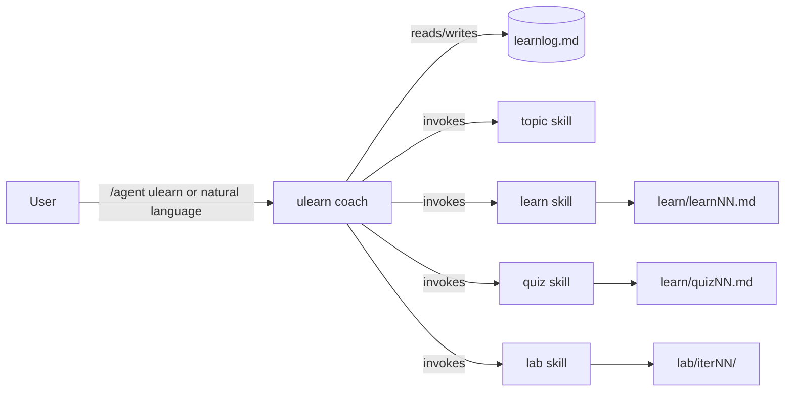

# AGENTS.md — Learning Loop plugin

This repository **is** a GitHub Copilot CLI plugin. This file is an overview/index
for humans and for agents editing this repo — it is **not** a runtime component
(when the plugin is installed and used in another folder, this file does not
auto-load; the runtime brain is the `ulearn` agent and the runtime protocol travels
inside the skills).

## The idea

An iterative, top-down study loop that keeps momentum and is fully resumable:

```
topic → learn → quiz → lab → repeat
```

Progress is tracked in `learnlog.md` in the learner's working directory, so a
session can stop and resume anytime, on any machine.

## How the pieces compose

- **`agents/ulearn.agent.md` — the coach (orchestrator).** Owns control flow and
  state: the loop state machine, the command surface (`next`/`prev`/`explain`/
  `check`), and reading/writing `learnlog.md`. It decides the next step and
  **invokes the matching step skill**.
- **Step skills — the capabilities**, each invoked by the coach. All skills are
  marked `user-invocable: false` — internal, never selected directly by the user;
  they self-ground from `learnlog.md`:
  - `skills/topic` — choose the next topic.
  - `skills/learn` — generate ~20-minute top-down materials → `learn/learnNN.md`.
  - `skills/quiz` — generate, run, and score a quiz → `learn/quizNN.md` + answers.
  - `skills/lab` — generate a LeetCode-style lab → `lab/iterNN/`.
- **Utility skills (internal, model-triggered):**
  - `skills/ucode` — understand part of a codebase (responsibilities + interactions).
  - `skills/lpp-lint` — validate an LPP module against the protocol.



## The protocol — LPP

All modules use **Literal Prompt Programming**, a shared author↔model vocabulary
(variables, prompt functions, command mapping, `EXECUTE_PROMPT`). It is a
*best-effort protocol the agent SHOULD follow*, not a runtime-enforced guarantee.
Canonical reference: **`lpp_spec.md`** (root). Dispatch between steps uses native
**skill invocation**; `EXECUTE_PROMPT` remains a convention for in-skill includes.

## Conventions for editing this repo

- Keep components **self-contained**: the agent inlines its LPP summary + schema, and
  each skill carries the detail it needs (e.g. `lpp-lint` encodes the checks inline).
  `lpp_spec.md` at the root is the single source of truth for the protocol.
- Stay **model- and tool-agnostic** — refer to capabilities, not product tool IDs or
  model names.
- Generated artifacts (`learn/`, `lab/`, `learnlog.md`, `.local/`) belong in the
  learner's working directory, never in this repo (see `.gitignore`).

See `README.md` for install and a walkthrough.
