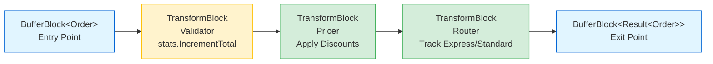

# Lab 08 - Resilient Data Processor

## Overview
Build an encapsulated dataflow block that processes customer orders with validation, pricing, and category-based routing. This lab demonstrates **production-ready error handling** using the Result<T> pattern, ensuring the pipeline never faults from validation errors.

## Scenario
Your e-commerce system processes customer orders. Each order needs:
1. **Validation** - Check for valid data (positive amount, valid email)
2. **Pricing** - Apply discounts based on customer tier
3. **Routing** - Route to express or standard fulfillment based on `Order.IsExpress` flag
4. **Error Handling** - Track failures without stopping the pipeline

**Order Data Model**:
```csharp
public record Order(string CustomerName, string Email, decimal Amount, bool IsExpress);
```
- `IsExpress = true` → Express fulfillment (track in stats.ExpressCount)
- `IsExpress = false` → Standard fulfillment (track in stats.StandardCount)

Requirements:
- Use Result<T> pattern for resilient error handling
- Encapsulate the entire pipeline into a single IPropagatorBlock
- Ensure PropagateCompletion = true on all internal links
- Track both successful and failed orders

## TODO N1 – Implement Result Type and Validation

**Objective**: Create a Result<T> type to represent success/failure states, and implement validation logic that returns Result instead of throwing exceptions.

**Requirements**:
- Define `Result<T>` record with:
  - `IsSuccess` property (bool)
  - `Value` property (T?, nullable)
  - `ErrorMessage` property (string?)
- Implement `ValidateOrder()` method that checks:
  - Amount > 0 (if not, return failure with "Invalid amount")
  - Email contains "@" (if not, return failure with "Invalid email")
  - If valid, return success with the order
- **Never throw exceptions** - always return a Result

**Key Concepts**:
- Result<T> pattern for error handling without exceptions
- Validation without faulting the pipeline
- Graceful failure representation

## TODO N2 – Build Encapsulated Pipeline

**Objective**: Create an encapsulated pipeline with validation, pricing, routing, and result collection stages.

**Requirements**:
- Entry point: BufferBlock<Order>
- Stage 1: Validation (TransformBlock<Order, Result<Order>>)
- Stage 2: Pricing - apply discounts (TransformBlock, pass through failures)
- Stage 3: Router - track express (IsExpress=true) vs standard (IsExpress=false) stats, pass through failures
- Stage 4: Merge results into single output (BufferBlock<Result<Order>>)
- **Set PropagateCompletion = true** on ALL internal links
- Use DataflowBlock.Encapsulate to wrap input and output
- Return IPropagatorBlock<Order, Result<Order>>

**Pipeline Architecture**:


**Key Concepts**:
- Multi-stage internal pipeline
- PropagateCompletion requirement
- Passing failures through stages without processing
- Encapsulate pattern (target entry + source exit)

## TODO N3 – Implement Statistics Tracking

**Objective**: Add a diagnostics object to track processing statistics across all stages.

**Requirements**:
- Create ProcessorStats class with:
  - `TotalProcessed` - total orders received
  - `SuccessCount` - successfully processed orders
  - `FailureCount` - validation failures
  - `ExpressCount` - orders with IsExpress=true (successful only)
  - `StandardCount` - orders with IsExpress=false (successful only)
- Pass stats object to pipeline creation
- Update counters at appropriate stages (thread-safe with Interlocked)
- Stats should be accessible after processing completes

**Key Concepts**:
- Diagnostics pattern for encapsulated blocks
- Thread-safe counter updates
- Exposing metrics without breaking encapsulation

## Expected Output
```
Processing 8 orders...

✓ Order 1 (Alice): SUCCESS - Express fulfillment
✓ Order 2 (Bob): SUCCESS - Standard fulfillment
✗ Order 3 (Invalid): FAILED - Invalid amount
✓ Order 4 (Carol): SUCCESS - Express fulfillment
✗ Order 5 (BadEmail): FAILED - Invalid email
✓ Order 6 (Dave): SUCCESS - Standard fulfillment
✓ Order 7 (Eve): SUCCESS - Express fulfillment
✓ Order 8 (Frank): SUCCESS - Standard fulfillment

Statistics:
- Total processed: 8
- Successful: 6
- Failed: 2
- Express: 3
- Standard: 3

✓ All orders processed
✓ Pipeline completed without faulting
✓ Correct success/failure counts
✓ Correct routing counts
```

## Hints
- See `REF.md` for detailed guidance on Result<T> pattern and encapsulation
- Remember: PropagateCompletion = true on ALL internal links
- Pass failures through stages without additional processing
- Use Interlocked for thread-safe counter updates
