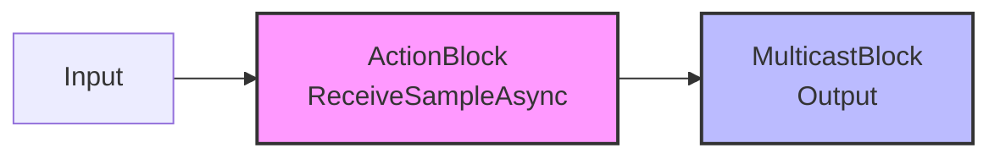
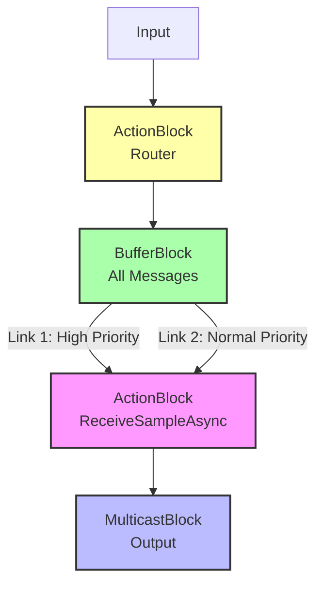

# DataFlow Priority Message Design

## Problem Statement

In a TPL DataFlow pipeline with an `ActionBlock` for input processing and a `MulticastBlock` for output, we need to handle two types of messages:

- **Data messages**: Regular messages that can tolerate processing delays
- **Control messages**: High-priority messages that must bypass slow processing

The current design processes all messages sequentially through `ReceiveSampleAsync`, which can cause control messages to be delayed behind slow data processing.

## Current Design

```csharp
_inputBlock = new ActionBlock<StreamSample>(
    async sample =>
    {
        try
        {
            await ReceiveSampleAsync(sample, DataFlowExecutionOptions.CancellationToken);
        }
        finally
        {
            sample.Release();
        }
    },
    DataFlowExecutionOptions);

_outputBlock = new MulticastBlock<StreamSample>(
    new ExecutionDataflowBlockOptions
    {
        BoundedCapacity = 1,
        EnsureOrdered = true,
        CancellationToken = DataFlowExecutionOptions.CancellationToken,
    },
    FlowLogger);
```

### Current Flow Diagram



**Issues:**

- Control messages stuck behind slow data processing
- No priority differentiation
- Sequential processing creates bottleneck

---

## Recommended Solution: Priority-Aware Buffer with Linked Processing

### Design Overview

All messages (both high-priority control and normal-priority data) flow through a buffer block. The processing block is linked with priority predicates to ensure high-priority messages are processed first when available.

### Key Benefits

- All messages go through the same processing pipeline (`ReceiveSampleAsync`)
- High-priority messages are processed before normal messages when both are available
- Simple implementation using DataFlow's built-in link predicates
- Buffer provides backpressure handling for both message types

### Implementation

```csharp
// Input router - sends all messages to buffer
_inputBlock = new ActionBlock<StreamSample>(
    async sample =>
    {
        // All messages (high and normal priority) go to the buffer
        await _bufferBlock.SendAsync(sample, DataFlowExecutionOptions.CancellationToken);
    },
    new ExecutionDataflowBlockOptions
    {
        BoundedCapacity = DataflowBlockOptions.Unbounded,
        MaxDegreeOfParallelism = 1,
        CancellationToken = DataFlowExecutionOptions.CancellationToken
    });

// Buffer for all messages
_bufferBlock = new BufferBlock<StreamSample>(
    new DataflowBlockOptions
    {
        BoundedCapacity = 100, // Adjust based on memory constraints
        CancellationToken = DataFlowExecutionOptions.CancellationToken
    });

// Processing block - handles all messages
_processingBlock = new ActionBlock<StreamSample>(
    async sample =>
    {
        try
        {
            await ReceiveSampleAsync(sample, DataFlowExecutionOptions.CancellationToken);
            await _outputBlock.SendAsync(sample, DataFlowExecutionOptions.CancellationToken);
        }
        finally
        {
            sample.Release();
        }
    },
    new ExecutionDataflowBlockOptions
    {
        BoundedCapacity = 1,
        MaxDegreeOfParallelism = 1,
        CancellationToken = DataFlowExecutionOptions.CancellationToken
    });

// Link buffer to processing with priority predicate
// High-priority messages are offered first
_bufferBlock.LinkTo(_processingBlock, 
    new DataflowLinkOptions { PropagateCompletion = true },
    sample => sample.IsHighPriority);

// Normal-priority messages are offered second
_bufferBlock.LinkTo(_processingBlock, 
    new DataflowLinkOptions { PropagateCompletion = true });

// Output multicast
_outputBlock = new MulticastBlock<StreamSample>(
    new ExecutionDataflowBlockOptions
    {
        BoundedCapacity = 1,
        EnsureOrdered = true, // Processing order maintained within priority levels
        CancellationToken = DataFlowExecutionOptions.CancellationToken,
    },
    FlowLogger);
```

### Flow Diagram



### How It Works

1. **Input Router**: All messages flow to `_bufferBlock` regardless of priority
2. **Buffer Block**: Stores all messages (both high and normal priority)
3. **Priority Links**: Two links from buffer to processing:
   - First link only accepts high-priority messages (`IsHighPriority == true`)
   - Second link accepts all messages (catch-all for normal priority)
4. **Processing**: When the processing block is ready, it pulls from the first matching link (high priority checked first)
5. **Output**: Processed messages flow to the multicast block

### Pros

- ✅ All messages go through the same `ReceiveSampleAsync` processing
- ✅ High-priority messages processed first when available
- ✅ Simple implementation using DataFlow's built-in link predicates
- ✅ Single buffer reduces complexity
- ✅ Buffer provides backpressure handling
- ✅ Minimal changes to existing code structure

### Cons

- ❌ High-priority messages can still wait if processing is currently busy with a normal message
- ❌ Priority is "soft" - already-started processing isn't interrupted
- ❌ Link predicate evaluation has minor overhead

### Additional Considerations

#### Memory Management

Careful attention to `sample.Release()` in all code paths is required, including error conditions.

#### Cancellation

Ensure all blocks respect the `CancellationToken` properly.

#### Monitoring

Consider adding metrics:

- Queue depth in buffer
- Processing time per message type
- High-priority message wait times
- Number of high vs normal priority messages processed

#### Testing

Test scenarios:

- High data load with urgent control messages
- Control message bursts
- Cancellation during processing
- Buffer overflow conditions
