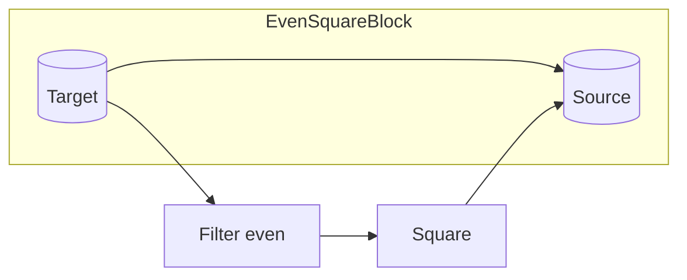
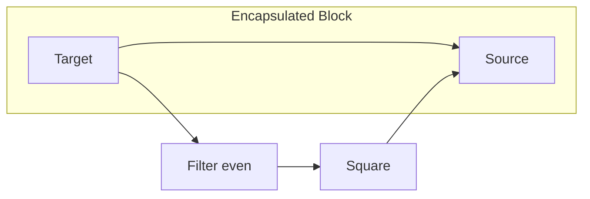
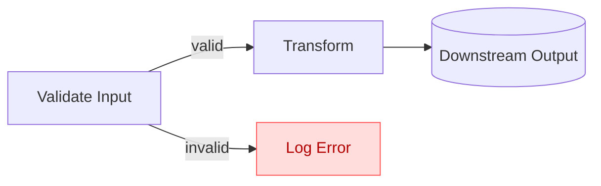
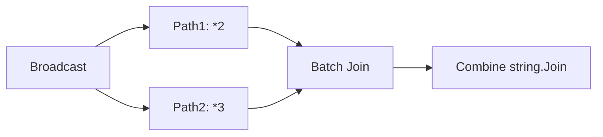
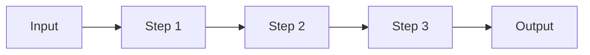

# Custom Blocks & Encapsulation in TPL Dataflow

## Top-Down Overview (Mental Map First)

Think of a complex dataflow pipeline like a small factory floor: raw items enter, move across specialized stations (validate, enrich, transform, aggregate), and finished products exit. Early on, you wire every station manually. As patterns repeat, you decide to build a single self-contained "machine" that performs a multi-step process internally but exposes only two sockets: IN and OUT. That machine is a custom (encapsulated) block.

Encapsulation gives you these superpowers:
- Collapse many moving parts into a single mental unit (lowers cognitive load)
- Compose higher-level architectures: pipelines of business concepts instead of plumbing pieces
- Swap internal implementation without changing the external contract (interface stability)
- Test multi-step behavior in isolation (simpler automated tests)

Core principle: A good custom block feels indistinguishable from a built-in block in usage: SendAsync in, link out, Complete(), await Completion.

Visual (Outside vs Inside) – Mermaid:



You only see the external shell (target/source); internal mini-graph stays hidden.

Transition heuristic: When you explain a pipeline with "first we..., then we..., then we..." more than twice in code reviews—consider encapsulating.

## Introduction: Why Custom Blocks?

As your dataflow pipelines grow, you'll find yourself repeating patterns:
- Multi-stage transformations that always go together
- Filtering + transforming combinations
- Complex routing logic

**Encapsulation** lets you wrap these patterns into reusable components that look and act like built-in blocks. This improves:
- **Reusability**: Write once, use many times
- **Maintainability**: Changes happen in one place
- **Testability**: Test components in isolation
- **Abstraction**: Hide complexity behind simple interfaces

## The Encapsulate Method

The `DataflowBlock.Encapsulate()` method is your primary tool for creating custom blocks. It takes:
- A **source block** (where data exits)
- A **target block** (where data enters)

And returns a **propagator block** that looks like a single unit from the outside.

### Basic Pattern

```csharp
public static IPropagatorBlock<TInput, TOutput> CreateCustomBlock<TInput, TOutput>()
{
    var inputBlock = new TransformBlock<TInput, TOutput>(...);
    var outputBlock = new TransformBlock<TOutput, TOutput>(...);
    
    inputBlock.LinkTo(outputBlock, new DataflowLinkOptions { PropagateCompletion = true });
    
    return DataflowBlock.Encapsulate(inputBlock, outputBlock);
}
```

**Key insight**: The encapsulated block exposes:
- The **target interface** of the input block (for posting messages)
- The **source interface** of the output block (for linking downstream)
- Completion propagates through the internal pipeline

## Example 1: Filter-Transform Block

Let's create a block that filters even numbers and then squares them:

```csharp
public static IPropagatorBlock<int, int> CreateEvenSquareBlock()
{
    var filterBlock = new TransformManyBlock<int, int>(n =>
    {
        if (n % 2 == 0)
            return new[] { n };
        else
            return Array.Empty<int>();
    });

    var squareBlock = new TransformBlock<int, int>(n => n * n);

    filterBlock.LinkTo(squareBlock, new DataflowLinkOptions { PropagateCompletion = true });

    return DataflowBlock.Encapsulate(filterBlock, squareBlock);
}

// Usage
var evenSquare = CreateEvenSquareBlock();
var printer = new ActionBlock<int>(n => Console.WriteLine(n));

evenSquare.LinkTo(printer, new DataflowLinkOptions { PropagateCompletion = true });

for (int i = 1; i <= 10; i++)
    await evenSquare.SendAsync(i);

evenSquare.Complete();
await printer.Completion;

// Output: 4, 16, 36, 64, 100
```

**Why this works**: Users of `CreateEvenSquareBlock()` don't need to know it's two blocks internally—it looks like one atomic operation.

## Example 2: Validate-Transform-Log Pipeline

A common pattern: validate input, transform valid data, log errors.

```csharp
public class ValidationResult<T>
{
    public bool IsValid { get; set; }
    public T? Data { get; set; }
    public string? ErrorMessage { get; set; }
}

public static IPropagatorBlock<string, int> CreateValidatedParserBlock()
{
    // Step 1: Validate and parse
    var validateBlock = new TransformBlock<string, ValidationResult<int>>(input =>
    {
        if (int.TryParse(input, out int result))
            return new ValidationResult<int> { IsValid = true, Data = result };
        else
            return new ValidationResult<int> { IsValid = false, ErrorMessage = $"Invalid: {input}" };
    });

    // Step 2: Split into success and error paths
    var successBlock = new TransformBlock<ValidationResult<int>, int>(r => r.Data!.Value);
    var errorBlock = new ActionBlock<ValidationResult<int>>(r => 
        Console.WriteLine($"[ERROR] {r.ErrorMessage}"));

    validateBlock.LinkTo(successBlock, 
        new DataflowLinkOptions { PropagateCompletion = true }, 
        r => r.IsValid);
    
    validateBlock.LinkTo(errorBlock, 
        new DataflowLinkOptions { PropagateCompletion = true }, 
        r => !r.IsValid);

    return DataflowBlock.Encapsulate(validateBlock, successBlock);
}

// Usage
var parser = CreateValidatedParserBlock();
var doubler = new TransformBlock<int, int>(n => n * 2);

parser.LinkTo(doubler, new DataflowLinkOptions { PropagateCompletion = true });

await parser.SendAsync("42");    // Success: outputs 84
await parser.SendAsync("hello"); // Logs error
await parser.SendAsync("10");    // Success: outputs 20

parser.Complete();
await doubler.Completion;
```

**Pattern**: Errors are handled internally (logged), but only valid data flows downstream. External users just see "string in, int out."

## Example 3: Throttling Block

Create a block that limits throughput to N items per second:

```csharp
public static IPropagatorBlock<T, T> CreateThrottleBlock<T>(int itemsPerSecond)
{
    var bufferBlock = new BufferBlock<T>();
    var throttleBlock = new TransformBlock<T, T>(
        async item =>
        {
            await Task.Delay(1000 / itemsPerSecond);
            return item;
        },
        new ExecutionDataflowBlockOptions { MaxDegreeOfParallelism = 1 });

    bufferBlock.LinkTo(throttleBlock, new DataflowLinkOptions { PropagateCompletion = true });

    return DataflowBlock.Encapsulate(bufferBlock, throttleBlock);
}

// Usage: limit to 5 items per second
var throttle = CreateThrottleBlock<int>(5);
var printer = new ActionBlock<int>(n => Console.WriteLine($"{DateTime.Now:HH:mm:ss.fff} - {n}"));

throttle.LinkTo(printer, new DataflowLinkOptions { PropagateCompletion = true });

for (int i = 1; i <= 20; i++)
    await throttle.SendAsync(i);

throttle.Complete();
await printer.Completion;
```

**Use case**: Rate-limiting API calls, preventing resource exhaustion, or smoothing bursty traffic.

## Composition Patterns

### Pattern 1: Pipeline Builder

Build complex pipelines step-by-step:

```csharp
public class PipelineBuilder<TInput, TOutput>
{
    private readonly IPropagatorBlock<TInput, TOutput> _pipeline;

    public PipelineBuilder(IPropagatorBlock<TInput, TOutput> pipeline)
    {
        _pipeline = pipeline;
    }

    public PipelineBuilder<TInput, TNewOutput> Then<TNewOutput>(
        Func<TOutput, TNewOutput> transform)
    {
        var transformBlock = new TransformBlock<TOutput, TNewOutput>(transform);
        _pipeline.LinkTo(transformBlock, new DataflowLinkOptions { PropagateCompletion = true });
        return new PipelineBuilder<TInput, TNewOutput>(
            DataflowBlock.Encapsulate(_pipeline, transformBlock));
    }

    public IPropagatorBlock<TInput, TOutput> Build() => _pipeline;
}

// Usage
var pipeline = new PipelineBuilder<int, int>(new TransformBlock<int, int>(x => x))
    .Then(x => x * 2)
    .Then(x => x + 10)
    .Then(x => x.ToString())
    .Build();
```

### Pattern 2: Fork-Join Encapsulation

Encapsulate parallel processing with recombination:

```csharp
public static IPropagatorBlock<int, string> CreateParallelProcessorBlock()
{
    var broadcastBlock = new BroadcastBlock<int>(null);
    
    var path1 = new TransformBlock<int, string>(n => $"Path1: {n * 2}");
    var path2 = new TransformBlock<int, string>(n => $"Path2: {n * 3}");
    
    var joinBlock = new BatchBlock<string>(2);
    var combineBlock = new TransformBlock<string[], string>(
        items => string.Join(" | ", items));

    broadcastBlock.LinkTo(path1, new DataflowLinkOptions { PropagateCompletion = true });
    broadcastBlock.LinkTo(path2, new DataflowLinkOptions { PropagateCompletion = true });
    
    path1.LinkTo(joinBlock, new DataflowLinkOptions { PropagateCompletion = true });
    path2.LinkTo(joinBlock, new DataflowLinkOptions { PropagateCompletion = true });
    
    joinBlock.LinkTo(combineBlock, new DataflowLinkOptions { PropagateCompletion = true });

    return DataflowBlock.Encapsulate(broadcastBlock, combineBlock);
}
```

## Best Practices

### ✅ DO: Always Propagate Completion

```csharp
// GOOD
inputBlock.LinkTo(outputBlock, new DataflowLinkOptions { PropagateCompletion = true });
```

Without this, calling `Complete()` on your custom block won't complete the internal pipeline.

### ✅ DO: Hide Implementation Details

```csharp
// GOOD: Return interface, not concrete type
public static IPropagatorBlock<int, int> CreateBlock() { ... }

// BAD: Exposes internal structure
public static (TransformBlock<int, int>, ActionBlock<int>) CreateBlock() { ... }
```

### ✅ DO: Make Blocks Configurable

```csharp
public static IPropagatorBlock<T, T> CreateThrottleBlock<T>(
    int itemsPerSecond,
    ExecutionDataflowBlockOptions? options = null)
{
    options ??= new ExecutionDataflowBlockOptions();
    // Use options for internal blocks
}
```

### ❌ DON'T: Forget Error Handling

If an internal block faults, the encapsulated block should fault too. PropagateCompletion handles this automatically.

### ❌ DON'T: Share Internal Blocks

```csharp
// BAD: Leaks internal block reference
private static TransformBlock<int, int> _sharedBlock = new(...);

public static IPropagatorBlock<int, int> CreateBlock()
{
    return DataflowBlock.Encapsulate(_sharedBlock, ...); // DON'T REUSE!
}
```

Each call to `CreateBlock()` should return a fresh, independent instance.

## When to Encapsulate

**Good candidates:**
- Repeating patterns across your codebase
- Multi-step transforms that logically belong together
- Complex validation + routing logic
- Cross-cutting concerns (logging, metrics, throttling)

**Not worth encapsulating:**
- Single-block wrappers (just use the block directly)
- One-off pipelines used in only one place
- Blocks that need frequent internal reconfiguration

## Summary

Custom blocks via encapsulation let you:

1. **Bundle complexity**: Hide multi-block pipelines behind simple interfaces
2. **Reuse patterns**: DRY principle for dataflow logic
3. **Compose flexibly**: Build pipelines from reusable components
4. **Maintain sanity**: Change implementations without affecting consumers

The `DataflowBlock.Encapsulate()` method is your Swiss Army knife—learn it well, and you'll build elegant, maintainable dataflow systems.

**Next steps**: Try creating a custom block for a pattern you've used multiple times in your labs. Common patterns: parse-validate-transform, filter-batch-process, retry-on-failure wrappers.

---
## Mental Model Visualization (Mermaid Only)

Outside: One propagator. Inside: Directed acyclic mini-network.

### Mermaid Diagrams

Below are equivalent Mermaid representations you can view in GitHub or VS Code (Markdown preview supports Mermaid).





Fork-Join Example:



Throttle Block Internals:


Pipeline Builder Concept:



---
## Design Heuristics Cheat Sheet

| Symptom | Encapsulate? | Rationale |
|---------|--------------|-----------|
| Copy-pasted block wiring 3+ times | Yes | DRY & maintainability |
| Multi-step business concept (e.g., "sanitize-calculate-summarize") | Yes | Single conceptual unit |
| Single TransformBlock only | No | Adds needless indirection |
| Pipeline needs runtime swapping (strategy pattern) | Yes | Replace internals behind stable shell |
| Blocks require coordinated completion/error handling | Yes | Encapsulation centralizes lifecycle |

---
## Quick API Cheat Sheet

```csharp
var encapsulated = DataflowBlock.Encapsulate(innerTargetBlock, innerSourceBlock);
// outer target methods: SendAsync, Post, Complete
// outer source methods: LinkTo, TryReceive, Completion
```

Checklist before returning:
1. All internal links use PropagateCompletion = true
2. No internal blocks leaked (no return of concrete inner types)
3. Exceptions either allowed to fault or handled consistently
4. Optional configuration surfaces (timeouts, degrees, capacities) exposed via parameters
5. Unit test posts inputs, completes, asserts outputs & completion state

---
## Micro Exercise (Try Now ~2 min)

Implement a custom block "RetryTransformBlock" wrapping a TransformBlock with simple retry (N attempts) on transient exceptions. Bonus: Parameterize delay/backoff.

---
## One-Liner Summary

Encapsulation converts recurring internal block graphs into clean reusable primitives, raising the abstraction level of your dataflow architecture.
