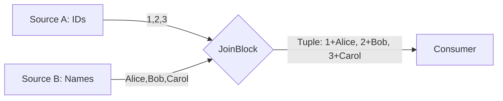
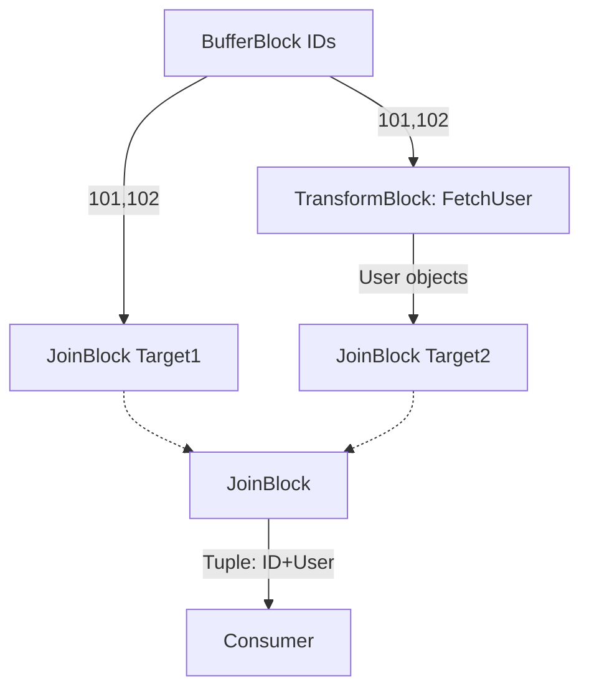
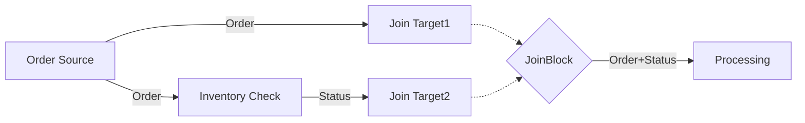

# JoinBlock & Coordinated Data Flows in TPL Dataflow

## Overview

**JoinBlock** is a special grouping block that synchronizes multiple independent data streams, waiting until it receives one item from *each* input before producing a matched tuple. Think of it as a "zip" operation for concurrent streams—it pairs up items from different sources that arrive at different times.



**Why JoinBlock?**
- Coordinate parallel data sources (e.g., user IDs + user profiles)
- Synchronize multi-step computations
- Build fan-in patterns where multiple streams converge
- Maintain ordering and pairing across async operations

---

## Core Concepts

### 1. Multi-Input Target Interface

JoinBlock exposes **separate target ports** for each input type:

```csharp
var join = new JoinBlock<int, string>();

// Post to different inputs
join.Target1.Post(42);        // int input
join.Target2.Post("Answer");  // string input

// Receive paired tuple
var result = await join.ReceiveAsync();  
// result is Tuple<int, string>: (42, "Answer")
```

**Intuition:** Each input is an independent "mailbox." JoinBlock waits for mail in *all* mailboxes before delivering a bundle.

### 2. Greedy vs Non-Greedy Modes

**Greedy Mode (default):**
- Immediately consumes items as they arrive
- Holds them in internal buffers until all inputs have items
- Fast, but can cause **unbounded buffering** if inputs arrive at different rates

```csharp
var greedyJoin = new JoinBlock<int, string>();
// Posts are consumed immediately, stored until paired
```

**Non-Greedy Mode:**
- Only consumes items when *all inputs have items available*
- Uses 2-phase protocol: reserves items, then commits atomically
- Prevents buffering, but requires all sources to have data ready

```csharp
var nonGreedyJoin = new JoinBlock<int, string>(
    new GroupingDataflowBlockOptions { Greedy = false }
);
// Only consumes when both inputs are available
```

**Heuristic:**
- Use **greedy** for balanced streams or when buffering is acceptable
- Use **non-greedy** to avoid memory buildup when sources have unpredictable rates

### 3. Ordering Guarantees

JoinBlock maintains **FIFO order per input**, pairing items in the order they arrived:

```csharp
join.Target1.Post(1);
join.Target1.Post(2);
join.Target2.Post("A");
join.Target2.Post("B");

// Output: (1, "A"), then (2, "B")
```

**Note:** If inputs arrive at different rates, later items queue up.

---

## JoinBlock Variants

TPL Dataflow provides overloads for 2-7 inputs:

```csharp
// 2 inputs
var join2 = new JoinBlock<int, string>();

// 3 inputs
var join3 = new JoinBlock<int, string, DateTime>();

// Access via Target1, Target2, Target3, etc.
join3.Target1.Post(42);
join3.Target2.Post("Data");
join3.Target3.Post(DateTime.Now);

var tuple = await join3.ReceiveAsync();
// tuple is Tuple<int, string, DateTime>
```

**Limitation:** Maximum 7 inputs. For more, chain multiple JoinBlocks or use custom blocks.

---

## Common Patterns

### Pattern 1: ID-Entity Lookup

Pair IDs with corresponding entities fetched from a database:

```csharp
var idSource = new BufferBlock<int>();
var entitySource = new TransformBlock<int, User>(
    async id => await FetchUserAsync(id)
);

var join = new JoinBlock<int, User>();

idSource.LinkTo(join.Target1);
idSource.LinkTo(entitySource);
entitySource.LinkTo(join.Target2);

// Post IDs
idSource.Post(101);
idSource.Post(102);

// Receive paired results
var (id, user) = await join.ReceiveAsync();
```



### Pattern 2: Multi-Source Aggregation

Combine results from parallel operations:

```csharp
var weatherBlock = new TransformBlock<string, Weather>(
    async city => await GetWeatherAsync(city)
);
var newsBlock = new TransformBlock<string, News>(
    async city => await GetNewsAsync(city)
);

var join = new JoinBlock<Weather, News>();

weatherBlock.LinkTo(join.Target1);
newsBlock.LinkTo(join.Target2);

// Trigger parallel fetches
weatherBlock.Post("Seattle");
newsBlock.Post("Seattle");

// Get synchronized result
var (weather, news) = await join.ReceiveAsync();
Console.WriteLine($"Temp: {weather.Temp}, Headlines: {news.Count}");
```

### Pattern 3: Synchronized Fan-In

Merge multiple processing paths that must complete together:

```csharp
var upperBlock = new TransformBlock<string, string>(s => s.ToUpper());
var lowerBlock = new TransformBlock<string, string>(s => s.ToLower());

var join = new JoinBlock<string, string>();

upperBlock.LinkTo(join.Target1);
lowerBlock.LinkTo(join.Target2);

// Process same input differently
upperBlock.Post("Hello");
lowerBlock.Post("Hello");

var (upper, lower) = await join.ReceiveAsync();
// ("HELLO", "hello")
```

---

## Configuration Options

```csharp
var options = new GroupingDataflowBlockOptions
{
    Greedy = false,                  // Non-greedy mode
    BoundedCapacity = 10,            // Max tuples buffered (output)
    MaxMessagesPerTask = 5,          // Processing batch size
    CancellationToken = cts.Token    // Cancellation support
};

var join = new JoinBlock<int, string>(options);
```

**BoundedCapacity note:** Applies to *output* buffer (completed tuples), not individual input buffers.

---

## Completion & Fault Propagation

JoinBlock completes when:
1. All input targets are completed (via `Complete()`)
2. All buffered items are paired and delivered

```csharp
var join = new JoinBlock<int, string>();

// Complete both inputs
join.Target1.Complete();
join.Target2.Complete();

await join.Completion;  // Waits for all pairs delivered
```

**Fault behavior:** If any input faults, JoinBlock faults immediately (stops pairing).

---

## Practical Example: Order Processing Pipeline

```csharp
// Scenario: Join order details with inventory status
var orderSource = new BufferBlock<Order>();
var inventoryCheck = new TransformBlock<Order, InventoryStatus>(
    async order => await CheckInventoryAsync(order.ProductId)
);

var join = new JoinBlock<Order, InventoryStatus>(
    new GroupingDataflowBlockOptions { Greedy = false }
);

var processingBlock = new ActionBlock<Tuple<Order, InventoryStatus>>(
    tuple =>
    {
        var (order, inventory) = tuple;
        if (inventory.InStock)
            Console.WriteLine($"Order {order.Id} approved");
        else
            Console.WriteLine($"Order {order.Id} backordered");
    }
);

// Link pipeline
orderSource.LinkTo(join.Target1);
orderSource.LinkTo(inventoryCheck);
inventoryCheck.LinkTo(join.Target2);
join.LinkTo(processingBlock);

// Post orders
orderSource.Post(new Order { Id = 1, ProductId = 42 });
orderSource.Post(new Order { Id = 2, ProductId = 99 });

// Completion flow
orderSource.Complete();
await join.Completion;
processingBlock.Complete();
await processingBlock.Completion;
```



---

## Best Practices

1. **Match input rates:** Wildly different posting rates cause buffering (greedy) or stalls (non-greedy)
2. **Complete all inputs:** JoinBlock won't complete until all targets are completed
3. **Handle unmatched items:** If sources produce different counts, some items will remain unpaired
4. **Bounded capacity:** Set on JoinBlock output if downstream is slow
5. **Use non-greedy for resource control:** When input sources are expensive or memory-limited
6. **Completion order:** Complete sources before waiting on JoinBlock.Completion

---

## Common Pitfalls

❌ **Forgetting to complete all inputs:**
```csharp
join.Target1.Complete();
// Target2 never completed → JoinBlock hangs
await join.Completion;  // Never completes!
```

✅ **Complete all targets:**
```csharp
join.Target1.Complete();
join.Target2.Complete();
await join.Completion;
```

❌ **Mismatched item counts:**
```csharp
join.Target1.Post(1);
join.Target1.Post(2);
join.Target2.Post("A");  // Only one item
// Second item (2) remains unpaired, lost on completion
```

✅ **Balance inputs or handle remainders explicitly**

---

## Quick Reference

| Feature | Description |
|---------|-------------|
| **Purpose** | Synchronize N input streams into tuples |
| **Inputs** | 2-7 separate target ports (Target1, Target2, ...) |
| **Output** | `Tuple<T1, T2, ...>` |
| **Greedy** | Consumes immediately, buffers until paired |
| **Non-Greedy** | Only consumes when all inputs ready |
| **Ordering** | FIFO per input |
| **Completion** | All inputs complete + all pairs delivered |
| **Fault** | Any input faults → JoinBlock faults |

---

## Exercise

**Challenge:** Build a price comparison pipeline that fetches prices from 3 vendors concurrently and pairs them for the same product ID.

**Hint structure:**
```csharp
var productIds = new BufferBlock<int>();
var vendor1 = new TransformBlock<int, decimal>(id => GetPrice1(id));
var vendor2 = new TransformBlock<int, decimal>(id => GetPrice2(id));
var vendor3 = new TransformBlock<int, decimal>(id => GetPrice3(id));

var join = new JoinBlock<decimal, decimal, decimal>();

// Link: productIds → each vendor → join
// Consumer: print lowest price
```
