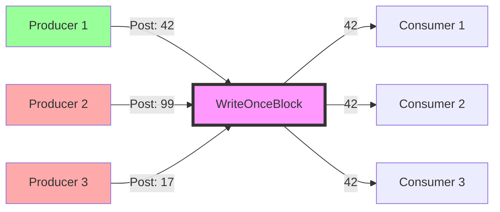
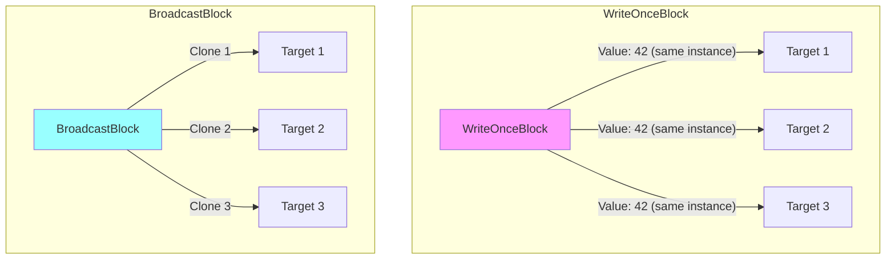

# WriteOnceBlock & Immutable Broadcasting

## Overview

**WriteOnceBlock<T>** is a specialized dataflow block that accepts exactly **one value** and broadcasts it to all connected targets. Once a value is written, the block ignores all subsequent offers—making it perfect for scenarios where you need **single-assignment semantics** with immutable broadcasting.

Think of it as a "write-once, read-many" variable in a concurrent environment.

## Core Concept: Single-Assignment Semantics



**Key Behavior**: 
- Producer 1 wins the race with value `42`
- Producers 2 & 3 are rejected (their posts return `false`)
- All consumers receive the same value `42`

## Why Use WriteOnceBlock?

### 1. **Race Condition Resolution**
When multiple producers compete to provide a single result:
```csharp
// Scenario: First available cache lookup wins
var cacheResult = new WriteOnceBlock<string>(null);

// Multiple cache sources race to provide result
Task.Run(() => redisCache.TryGetAsync("key").ContinueWith(t => 
    cacheResult.Post(t.Result)));
Task.Run(() => memoryCache.TryGet("key", out var val) && 
    cacheResult.Post(val));
Task.Run(() => diskCache.TryGetAsync("key").ContinueWith(t => 
    cacheResult.Post(t.Result)));

// First successful result wins, others are ignored
string result = await cacheResult.ReceiveAsync();
```

### 2. **Configuration/Initialization Values**
Broadcast a single configuration value to multiple components:
```csharp
var configBlock = new WriteOnceBlock<AppConfig>(null);

// Configuration loader wins the race
await LoadConfigurationAsync(configBlock);

// Multiple components link to receive the same config
configBlock.LinkTo(databaseService);
configBlock.LinkTo(apiService);
configBlock.LinkTo(cacheService);
```

### 3. **Immutable Broadcasting**
Unlike `BroadcastBlock`, `WriteOnceBlock` guarantees the same instance is broadcast (no cloning):
```csharp
// BroadcastBlock: clones messages (requires cloningFunction)
var broadcast = new BroadcastBlock<Data>(data => data.Clone());

// WriteOnceBlock: broadcasts same instance (immutable)
var writeOnce = new WriteOnceBlock<Data>(null);
```

## Construction & Usage

### Basic Creation
```csharp
// Simple constructor
var block = new WriteOnceBlock<int>(null);

// With options
var block = new WriteOnceBlock<Config>(null, new DataflowBlockOptions
{
    TaskScheduler = TaskScheduler.Default,
    CancellationToken = cancellationToken
});
```

**Cloning Function Parameter**: Always pass `null` because WriteOnceBlock doesn't clone—it broadcasts the same instance.

### Posting Values
```csharp
var block = new WriteOnceBlock<string>(null);

// First post wins
bool accepted1 = block.Post("First");   // true
bool accepted2 = block.Post("Second");  // false
bool accepted3 = block.Post("Third");   // false

// All consumers receive "First"
string value = await block.ReceiveAsync(); // "First"
```

### Consuming Values
```csharp
// Method 1: Direct receive
string value = await block.ReceiveAsync();

// Method 2: Link to target
block.LinkTo(actionBlock);

// Method 3: TryReceive (non-blocking)
if (block.TryReceive(out var result))
{
    Console.WriteLine($"Got: {result}");
}
```

## Key Characteristics

### ✅ Guarantees
- **Single Write**: Only the first successful post is accepted
- **No Cloning**: Same object instance broadcast to all targets
- **Thread-Safe**: Safe for concurrent posts from multiple threads
- **Broadcast Semantics**: All linked targets receive the value

### ⚠️ Important Notes
- Once a value is set, the block **never** accepts new values (even after completion)
- The block completes when you call `Complete()`, not when it receives a value
- If no value is posted before completion, linked targets receive nothing
- The cloning function parameter should always be `null`

## Common Patterns

### Pattern 1: First-Wins Competition
Multiple async operations race; first result is used:
```csharp
var resultBlock = new WriteOnceBlock<SearchResult>(null);

// Start multiple search providers
var tasks = searchProviders.Select(provider =>
    Task.Run(async () =>
    {
        var result = await provider.SearchAsync(query);
        resultBlock.Post(result); // First one wins
    }));

// Wait for first result
var winner = await resultBlock.ReceiveAsync();
Console.WriteLine($"Fastest provider: {winner.ProviderName}");
```

### Pattern 2: Lazy Initialization
Initialize expensive resource once, share with all consumers:
```csharp
var lazyResource = new WriteOnceBlock<ExpensiveResource>(null);

async Task<ExpensiveResource> GetResourceAsync()
{
    // Try to receive existing value
    if (lazyResource.TryReceive(out var existing))
        return existing;
    
    // Initialize and post (first caller wins)
    var resource = await ExpensiveResource.CreateAsync();
    lazyResource.Post(resource);
    
    return await lazyResource.ReceiveAsync();
}
```

### Pattern 3: Signal Broadcasting
Broadcast a single signal to multiple waiting tasks:
```csharp
var startSignal = new WriteOnceBlock<bool>(null);

// Multiple workers wait for start signal
var workers = Enumerable.Range(1, 5).Select(i =>
    Task.Run(async () =>
    {
        await startSignal.ReceiveAsync();
        Console.WriteLine($"Worker {i} started!");
        // Do work...
    }));

// Broadcast start signal to all
startSignal.Post(true);

await Task.WhenAll(workers);
```

## WriteOnceBlock vs BroadcastBlock

| Feature | WriteOnceBlock | BroadcastBlock |
|---------|----------------|----------------|
| **Values Accepted** | Exactly one | Unlimited (keeps latest) |
| **Cloning** | Never clones | Clones each message |
| **Use Case** | Single initialization | Continuous state updates |
| **Race Resolution** | First-wins | Latest-wins |
| **Immutability** | Same instance to all | Cloned instance to each |



## Completion & Error Handling

### Completion Behavior
```csharp
var block = new WriteOnceBlock<int>(null);

// Post value
block.Post(42);

// Complete the block
block.Complete();

// Can still receive the value after completion
int value = await block.ReceiveAsync(); // 42

// But new posts are rejected (block is completed)
bool accepted = block.Post(99); // false
```

### Handling Missing Values
```csharp
var block = new WriteOnceBlock<string>(null);

// Complete without posting
block.Complete();

try
{
    // This throws InvalidOperationException
    var value = await block.ReceiveAsync();
}
catch (InvalidOperationException)
{
    Console.WriteLine("Block completed without a value");
}

// Safe alternative: TryReceive
if (block.TryReceive(out var result))
{
    Console.WriteLine($"Got: {result}");
}
else
{
    Console.WriteLine("No value available");
}
```

## Practical Example: Multi-Source Configuration Loader

```csharp
public class ConfigurationService
{
    private readonly WriteOnceBlock<AppConfig> _configBlock;
    
    public ConfigurationService()
    {
        _configBlock = new WriteOnceBlock<AppConfig>(null);
        
        // Start multiple config loaders (first wins)
        Task.Run(() => LoadFromEnvironmentVariables());
        Task.Run(() => LoadFromConfigFile());
        Task.Run(() => LoadFromRemoteServer());
    }
    
    private async Task LoadFromEnvironmentVariables()
    {
        var config = new AppConfig { Source = "Environment" };
        // Simulate work
        await Task.Delay(50);
        
        if (_configBlock.Post(config))
            Console.WriteLine("✓ Environment variables loaded");
    }
    
    private async Task LoadFromConfigFile()
    {
        var config = new AppConfig { Source = "File" };
        await Task.Delay(100);
        
        if (_configBlock.Post(config))
            Console.WriteLine("✓ Config file loaded");
    }
    
    private async Task LoadFromRemoteServer()
    {
        var config = new AppConfig { Source = "Remote" };
        await Task.Delay(150);
        
        if (_configBlock.Post(config))
            Console.WriteLine("✓ Remote config loaded");
    }
    
    public async Task<AppConfig> GetConfigAsync()
    {
        return await _configBlock.ReceiveAsync();
    }
}

// Usage
var service = new ConfigurationService();
var config = await service.GetConfigAsync();
Console.WriteLine($"Using config from: {config.Source}");
// Output: Using config from: Environment (fastest)
```

## Best Practices

### ✅ Do:
- Use for single-initialization scenarios
- Use when racing multiple async operations
- Use for broadcasting immutable data
- Check `Post()` return value to detect races
- Use `TryReceive()` when value might not be available

### ❌ Don't:
- Don't use for streaming data (use BroadcastBlock instead)
- Don't pass a cloning function (always use `null`)
- Don't expect multiple values
- Don't forget to handle completion without value case
- Don't use for mutable shared state (race conditions)

## Performance Considerations

**Memory**: Minimal overhead—stores single value  
**Thread Safety**: Lock-free for post operations  
**Latency**: Near-zero once value is set (no cloning)  
**Throughput**: N/A (single value only)

## Testing Patterns

```csharp
[Fact]
public async Task FirstPostWins()
{
    var block = new WriteOnceBlock<int>(null);
    
    // Race multiple posts
    var tasks = Enumerable.Range(1, 100).Select(i =>
        Task.Run(() => block.Post(i)));
    
    await Task.WhenAll(tasks);
    
    // Exactly one value wins
    var value = await block.ReceiveAsync();
    Assert.InRange(value, 1, 100);
    
    // All subsequent receives get same value
    var value2 = await block.ReceiveAsync();
    Assert.Equal(value, value2);
}
```

## Summary

**WriteOnceBlock<T>** is your go-to block when you need:
- ✅ Single-assignment semantics in concurrent scenarios
- ✅ First-wins race resolution
- ✅ Immutable broadcasting (no cloning)
- ✅ Lazy initialization patterns
- ✅ Configuration/signal distribution

It elegantly solves the "multiple producers, first result wins" problem while providing broadcast semantics for multiple consumers.
