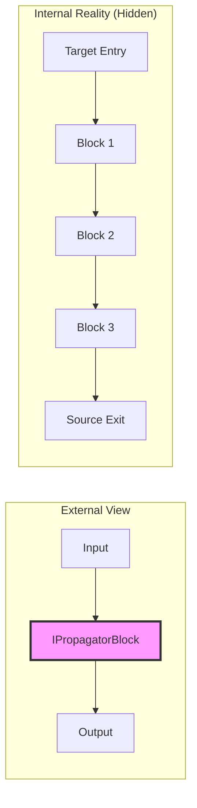
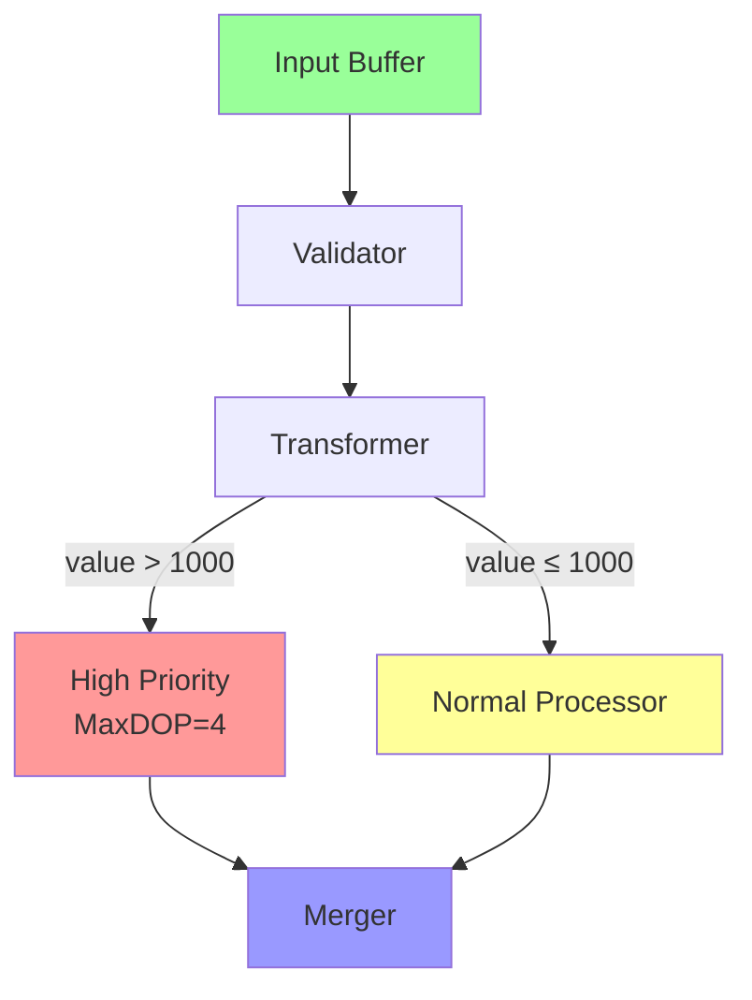

# DataflowBlock.Encapsulate & Advanced Composition

## Overview

**DataflowBlock.Encapsulate** is a powerful static method that wraps internal dataflow pipeline complexity into a single, reusable block with clean interfaces. It enables you to build sophisticated **dataflow libraries** with encapsulated multi-stage processing while exposing only the essential input/output interfaces.

Think of it as **creating your own custom block types** that hide implementation details and provide clean, composable APIs.

## Why Advanced Composition Matters

As your dataflow pipelines grow in complexity, you need:
- ✅ **Reusability** - Package common patterns as reusable components
- ✅ **Abstraction** - Hide internal complexity from consumers
- ✅ **Maintainability** - Isolate changes to internal implementation
- ✅ **Testability** - Test complex pipelines as single units
- ✅ **Composability** - Build larger systems from smaller, well-defined blocks

## DataflowBlock.Encapsulate Basics

### Method Signature
```csharp
public static IPropagatorBlock<TInput, TOutput> Encapsulate<TInput, TOutput>(
    ITargetBlock<TInput> target,
    ISourceBlock<TOutput> source
)
```

### Core Concept
Encapsulate takes a **target** (entry point) and **source** (exit point) and wraps them into a single **IPropagatorBlock** that hides everything in between.



## Simple Example: Validation Pipeline

Let's build a reusable email validation block:

```csharp
public static IPropagatorBlock<string, string> CreateEmailValidator()
{
    // Internal pipeline
    var inputBuffer = new BufferBlock<string>();
    
    var validateBlock = new TransformBlock<string, string>(email =>
    {
        if (string.IsNullOrWhiteSpace(email))
            return null;
        
        if (!email.Contains("@"))
            return null;
        
        return email.ToLower().Trim();
    });
    
    var filterBlock = new TransformBlock<string, string>(email =>
        email // null values are automatically filtered
    );
    
    // Link internal blocks
    inputBuffer.LinkTo(validateBlock, new DataflowLinkOptions 
        { PropagateCompletion = true });
    validateBlock.LinkTo(filterBlock, new DataflowLinkOptions 
        { PropagateCompletion = true });
    
    // Encapsulate: expose only input and output
    return DataflowBlock.Encapsulate(inputBuffer, filterBlock);
}

// Usage - consumers see just a simple block
var emailValidator = CreateEmailValidator();
emailValidator.LinkTo(nextStage);
emailValidator.Post("user@example.com");
```

## Advanced Pattern: Filter-Transform-Route

Build a sophisticated processing block with internal routing:

```csharp
public class DataProcessor
{
    public static IPropagatorBlock<RawData, ProcessedData> CreateProcessor()
    {
        // Entry point
        var input = new BufferBlock<RawData>();
        
        // Stage 1: Validate
        var validator = new TransformBlock<RawData, RawData>(data =>
        {
            if (data.IsValid)
                return data;
            throw new ArgumentException($"Invalid data: {data.Id}");
        });
        
        // Stage 2: Transform
        var transformer = new TransformBlock<RawData, IntermediateData>(data =>
            new IntermediateData
            {
                Id = data.Id,
                Value = data.Value * 2,
                Timestamp = DateTime.UtcNow
            });
        
        // Stage 3: Route by value
        var highPriorityProcessor = new TransformBlock<IntermediateData, ProcessedData>(
            data => new ProcessedData(data) { Priority = "High" },
            new ExecutionDataflowBlockOptions { MaxDegreeOfParallelism = 4 });
        
        var normalProcessor = new TransformBlock<IntermediateData, ProcessedData>(
            data => new ProcessedData(data) { Priority = "Normal" });
        
        // Stage 4: Merge results
        var merger = new BufferBlock<ProcessedData>();
        
        // Link pipeline
        var linkOptions = new DataflowLinkOptions { PropagateCompletion = true };
        
        input.LinkTo(validator, linkOptions);
        validator.LinkTo(transformer, linkOptions);
        
        // Route by value
        transformer.LinkTo(highPriorityProcessor, linkOptions, 
            data => data.Value > 1000);
        transformer.LinkTo(normalProcessor, linkOptions, 
            data => data.Value <= 1000);
        
        highPriorityProcessor.LinkTo(merger, linkOptions);
        normalProcessor.LinkTo(merger, linkOptions);
        
        // Expose only input and output
        return DataflowBlock.Encapsulate(input, merger);
    }
}
```



## Pattern: Configurable Processing Block

Build blocks with configuration options:

```csharp
public class ConfigurableProcessor
{
    public class Config
    {
        public int MaxDegreeOfParallelism { get; set; } = 1;
        public int BoundedCapacity { get; set; } = -1;
        public bool EnableLogging { get; set; } = false;
        public TimeSpan Timeout { get; set; } = TimeSpan.FromSeconds(30);
    }
    
    public static IPropagatorBlock<TInput, TOutput> Create<TInput, TOutput>(
        Func<TInput, TOutput> processor,
        Config config)
    {
        // Entry buffer
        var input = new BufferBlock<TInput>(new DataflowBlockOptions
        {
            BoundedCapacity = config.BoundedCapacity
        });
        
        // Processing block with config
        var process = new TransformBlock<TInput, TOutput>(
            async input =>
            {
                if (config.EnableLogging)
                    Console.WriteLine($"Processing: {input}");
                
                var cts = new CancellationTokenSource(config.Timeout);
                try
                {
                    return await Task.Run(() => processor(input), cts.Token);
                }
                catch (OperationCanceledException)
                {
                    throw new TimeoutException($"Processing timed out after {config.Timeout}");
                }
            },
            new ExecutionDataflowBlockOptions
            {
                MaxDegreeOfParallelism = config.MaxDegreeOfParallelism,
                BoundedCapacity = config.BoundedCapacity
            });
        
        // Output buffer
        var output = new BufferBlock<TOutput>(new DataflowBlockOptions
        {
            BoundedCapacity = config.BoundedCapacity
        });
        
        // Link with completion propagation
        var linkOptions = new DataflowLinkOptions { PropagateCompletion = true };
        input.LinkTo(process, linkOptions);
        process.LinkTo(output, linkOptions);
        
        return DataflowBlock.Encapsulate(input, output);
    }
}

// Usage
var config = new ConfigurableProcessor.Config
{
    MaxDegreeOfParallelism = 4,
    BoundedCapacity = 100,
    EnableLogging = true,
    Timeout = TimeSpan.FromSeconds(10)
};

var processor = ConfigurableProcessor.Create<int, int>(
    x => x * x,
    config);
```

## Pattern: Fork-Join with Diagnostics

Build a block that splits processing into multiple paths and rejoins:

```csharp
public class ForkJoinProcessor
{
    public class Diagnostics
    {
        public int ProcessedCount { get; set; }
        public int UpperCaseCount { get; set; }
        public int LowerCaseCount { get; set; }
    }
    
    public static IPropagatorBlock<string, (string upper, string lower)> Create(
        Diagnostics diagnostics)
    {
        // Entry
        var input = new BroadcastBlock<string>(s => s);
        
        // Fork into two paths
        var upperPath = new TransformBlock<string, string>(s =>
        {
            diagnostics.UpperCaseCount++;
            return s.ToUpper();
        });
        
        var lowerPath = new TransformBlock<string, string>(s =>
        {
            diagnostics.LowerCaseCount++;
            return s.ToLower();
        });
        
        // Join results
        var joinBlock = new JoinBlock<string, string>();
        
        // Output
        var output = new TransformBlock<Tuple<string, string>, (string, string)>(
            tuple =>
            {
                diagnostics.ProcessedCount++;
                return (tuple.Item1, tuple.Item2);
            });
        
        // Link pipeline
        var linkOptions = new DataflowLinkOptions { PropagateCompletion = true };
        
        input.LinkTo(upperPath, linkOptions);
        input.LinkTo(lowerPath, linkOptions);
        
        upperPath.LinkTo(joinBlock.Target1, linkOptions);
        lowerPath.LinkTo(joinBlock.Target2, linkOptions);
        
        joinBlock.LinkTo(output, linkOptions);
        
        return DataflowBlock.Encapsulate(input, output);
    }
}

// Usage with diagnostics
var diagnostics = new ForkJoinProcessor.Diagnostics();
var processor = ForkJoinProcessor.Create(diagnostics);

processor.Post("Hello");
processor.Post("World");
processor.Complete();

await processor.Completion;

Console.WriteLine($"Processed: {diagnostics.ProcessedCount}");
Console.WriteLine($"Upper: {diagnostics.UpperCaseCount}, Lower: {diagnostics.LowerCaseCount}");
```

## Pattern: Retry Logic Encapsulation

Build a block that retries failed operations:

```csharp
public class RetryProcessor
{
    public static IPropagatorBlock<TInput, TOutput> CreateWithRetry<TInput, TOutput>(
        Func<TInput, Task<TOutput>> processor,
        int maxRetries = 3,
        TimeSpan retryDelay = default)
    {
        if (retryDelay == default)
            retryDelay = TimeSpan.FromMilliseconds(100);
        
        var input = new BufferBlock<TInput>();
        
        var processWithRetry = new TransformBlock<TInput, TOutput>(
            async item =>
            {
                for (int attempt = 0; attempt <= maxRetries; attempt++)
                {
                    try
                    {
                        return await processor(item);
                    }
                    catch (Exception ex)
                    {
                        if (attempt == maxRetries)
                            throw new AggregateException(
                                $"Failed after {maxRetries} retries", ex);
                        
                        await Task.Delay(retryDelay * (attempt + 1)); // Exponential backoff
                    }
                }
                
                throw new InvalidOperationException("Unreachable");
            });
        
        var output = new BufferBlock<TOutput>();
        
        var linkOptions = new DataflowLinkOptions { PropagateCompletion = true };
        input.LinkTo(processWithRetry, linkOptions);
        processWithRetry.LinkTo(output, linkOptions);
        
        return DataflowBlock.Encapsulate(input, output);
    }
}

// Usage
var retryProcessor = RetryProcessor.CreateWithRetry<string, string>(
    async url =>
    {
        using var client = new HttpClient();
        return await client.GetStringAsync(url);
    },
    maxRetries: 3,
    retryDelay: TimeSpan.FromSeconds(1));
```

## Completion Propagation Rules

When using Encapsulate, completion must flow through the internal pipeline:

### ✅ Correct: Propagate Completion on All Links
```csharp
var linkOptions = new DataflowLinkOptions { PropagateCompletion = true };

input.LinkTo(stage1, linkOptions);
stage1.LinkTo(stage2, linkOptions);
stage2.LinkTo(output, linkOptions);

return DataflowBlock.Encapsulate(input, output);
```

### ❌ Incorrect: Missing Propagation
```csharp
// Without PropagateCompletion, internal blocks won't complete
input.LinkTo(stage1); // ❌ Completion won't propagate
stage1.LinkTo(stage2); // ❌ Completion won't propagate

return DataflowBlock.Encapsulate(input, output);

// Calling .Complete() on the encapsulated block won't complete the output!
```

## Best Practices

### ✅ Do:
1. **Always use PropagateCompletion = true** on all internal links
2. **Validate configuration** before building pipelines
3. **Provide diagnostics/metrics** for production blocks
4. **Document exposed interfaces** clearly
5. **Handle null propagation** explicitly (use predicates or filters)
6. **Test encapsulated blocks** as units
7. **Consider thread safety** for shared state (diagnostics, config)
8. **Use BufferBlock** for entry/exit when you need queuing

### ❌ Don't:
1. **Don't expose internal blocks** to consumers
2. **Don't forget NullTarget** for unmatched predicates
3. **Don't skip error handling** in internal blocks
4. **Don't use mutable configuration** after pipeline creation
5. **Don't create memory leaks** with improper completion
6. **Don't ignore bounded capacity** in production scenarios

## Multi-Stage Pipeline Example

Complete example with validation, transformation, routing, and aggregation:

```csharp
public class OrderProcessor
{
    public static IPropagatorBlock<Order, OrderResult> CreatePipeline()
    {
        // Stage 1: Input buffer
        var input = new BufferBlock<Order>();
        
        // Stage 2: Validate orders
        var validator = new TransformBlock<Order, Order>(order =>
        {
            if (order.Amount <= 0)
                throw new ArgumentException("Invalid order amount");
            return order;
        });
        
        // Stage 3: Apply discount
        var discounter = new TransformBlock<Order, Order>(order =>
        {
            if (order.Amount > 1000)
                order.Amount *= 0.9m; // 10% discount
            return order;
        });
        
        // Stage 4: Route by priority
        var expressProcessor = new TransformBlock<Order, OrderResult>(
            order => new OrderResult(order) { ProcessingTime = TimeSpan.FromMinutes(1) },
            new ExecutionDataflowBlockOptions { MaxDegreeOfParallelism = 4 });
        
        var standardProcessor = new TransformBlock<Order, OrderResult>(
            order => new OrderResult(order) { ProcessingTime = TimeSpan.FromHours(1) });
        
        // Stage 5: Merge results
        var output = new BufferBlock<OrderResult>();
        
        // Build pipeline
        var opts = new DataflowLinkOptions { PropagateCompletion = true };
        
        input.LinkTo(validator, opts);
        validator.LinkTo(discounter, opts);
        
        discounter.LinkTo(expressProcessor, opts, order => order.IsExpress);
        discounter.LinkTo(standardProcessor, opts, order => !order.IsExpress);
        
        expressProcessor.LinkTo(output, opts);
        standardProcessor.LinkTo(output, opts);
        
        // Encapsulate everything
        return DataflowBlock.Encapsulate(input, output);
    }
}
```

## Testing Encapsulated Blocks

```csharp
[Fact]
public async Task EncapsulatedBlock_ProcessesCorrectly()
{
    // Arrange
    var processor = DataProcessor.CreateProcessor();
    var results = new List<ProcessedData>();
    
    var collector = new ActionBlock<ProcessedData>(data => results.Add(data));
    processor.LinkTo(collector, new DataflowLinkOptions { PropagateCompletion = true });
    
    // Act
    for (int i = 0; i < 100; i++)
    {
        processor.Post(new RawData { Id = i, Value = i * 10 });
    }
    
    processor.Complete();
    await collector.Completion;
    
    // Assert
    Assert.Equal(100, results.Count);
    Assert.All(results, r => Assert.True(r.Priority == "High" || r.Priority == "Normal"));
}
```

## Performance Considerations

**Benefits of Encapsulation**:
- ✅ Reusability reduces duplicate code
- ✅ Abstraction enables optimization of internals
- ✅ Testing isolated blocks improves quality
- ✅ Clear interfaces reduce integration bugs

**Performance Tips**:
- Use `BoundedCapacity` to control memory
- Configure `MaxDegreeOfParallelism` appropriately
- Consider `EnsureOrdered = false` for better throughput
- Profile encapsulated blocks as units
- Monitor diagnostics in production

## Summary

**DataflowBlock.Encapsulate** enables you to:
- ✅ Build reusable dataflow libraries with clean APIs
- ✅ Hide internal pipeline complexity from consumers
- ✅ Create configurable, testable processing blocks
- ✅ Compose complex systems from simple building blocks
- ✅ Maintain separation of concerns in dataflow architectures

**Key Pattern**: Always link internal blocks with `PropagateCompletion = true`, then encapsulate the entry target and exit source into a single propagator block.

This enables building sophisticated, maintainable dataflow systems that scale from simple transformations to complex enterprise pipelines.
