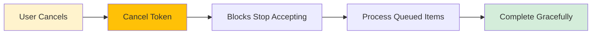
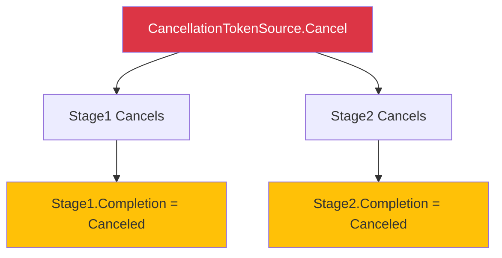
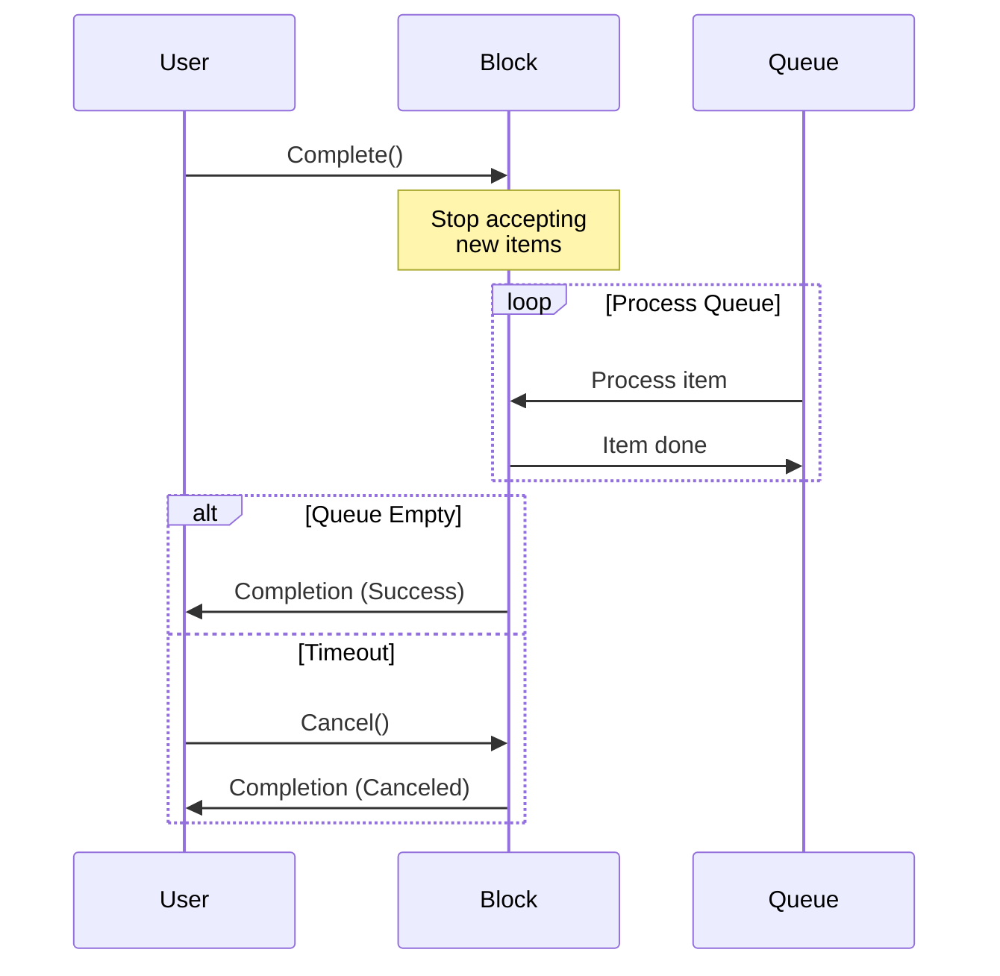
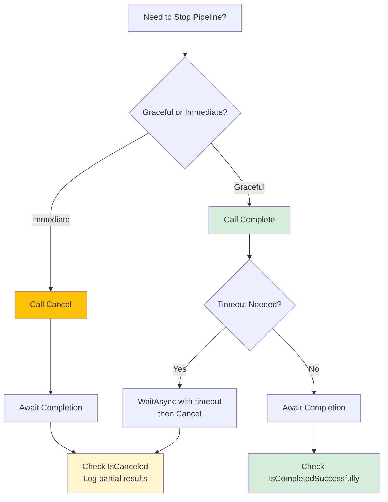

# CancellationToken Integration & Graceful Shutdown in TPL Dataflow

## Overview

In production systems, you need to stop dataflow pipelines gracefully—whether due to user requests, timeouts, or errors. This lesson covers how to use `CancellationToken` to coordinate shutdown, handle partial completion, and clean up resources properly.

---

## 1. Core Concepts

### What is CancellationToken?

`CancellationToken` is .NET's cooperative cancellation mechanism. It allows you to signal and respond to cancellation requests across async operations.

**Key Components:**
- `CancellationTokenSource` - Creates and controls cancellation
- `CancellationToken` - Passed to operations to check cancellation state
- `token.IsCancellationRequested` - Check if cancellation was requested
- `token.ThrowIfCancellationRequested()` - Throws `OperationCanceledException`

### Why Cancellation in Dataflow?



**Real-world scenarios:**
- User clicks "Cancel" button
- Request timeout expires
- Error threshold exceeded
- Application shutdown
- Resource constraints detected

---

## 2. Cancellation Propagation Patterns

### Pattern 1: Block-Level Cancellation

Pass `CancellationToken` to `DataflowBlockOptions`:

```csharp
var cts = new CancellationTokenSource();

var block = new TransformBlock<int, int>(
    x => x * 2,
    new ExecutionDataflowBlockOptions
    {
        CancellationToken = cts.Token,
        BoundedCapacity = 100
    });

// Later: cancel
cts.Cancel();
```

**What happens:**
1. Block stops accepting new items (`Post()` returns `false`)
2. Queued items are still processed
3. Block completes when queue drains
4. `block.Completion` transitions to `Canceled` state

### Pattern 2: Pipeline-Wide Cancellation

```csharp
var cts = new CancellationTokenSource();
var options = new ExecutionDataflowBlockOptions
{
    CancellationToken = cts.Token
};

var stage1 = new TransformBlock<int, string>(x => x.ToString(), options);
var stage2 = new ActionBlock<string>(x => Console.WriteLine(x), options);

stage1.LinkTo(stage2, new DataflowLinkOptions { PropagateCompletion = true });

// Cancel entire pipeline
cts.Cancel();
```

**Propagation Flow:**


---

## 3. Cancellation vs Completion vs Fault

### The Three Terminal States

| State | Cause | Completion Property |
|-------|-------|-------------------|
| **Completed** | All items processed, `Complete()` called | `IsCompletedSuccessfully = true` |
| **Canceled** | `CancellationToken` triggered | `IsCanceled = true` |
| **Faulted** | Unhandled exception | `IsFaulted = true` |

### Checking State

`await block.Completion` throws if the block is faulted or canceled, so you need either a `try/catch` or a status check *before* awaiting. Two common patterns:

```csharp
// 1) Await and handle terminal states via try/catch
try
{
    await block.Completion;
    Console.WriteLine("✓ All items processed");
}
catch (OperationCanceledException)
{
    Console.WriteLine("⚠ Canceled - partial completion");
}
catch (Exception ex)
{
    Console.WriteLine($"✗ Faulted - {ex.Message}");
}

// 2) Inspect Task status first (no exceptions thrown)
var completion = block.Completion;
if (completion.IsCompletedSuccessfully)
    Console.WriteLine("✓ All items processed");
else if (completion.IsCanceled)
    Console.WriteLine("⚠ Canceled - partial completion");
else if (completion.IsFaulted)
    Console.WriteLine("✗ Faulted - " + completion.Exception?.Message);
```

---

## 4. Graceful Shutdown Pattern

### The Challenge

When canceling, you want to:

1. Stop accepting new items immediately
2. Process items already in the pipeline
3. Clean up resources properly
4. Report partial results

### Solution: Two-Phase Shutdown

```csharp
public class GracefulProcessor
{
    private readonly CancellationTokenSource _cts = new();
    private readonly TransformBlock<int, int> _block;
    
    public GracefulProcessor()
    {
        _block = new TransformBlock<int, int>(
            ProcessItem,
            new ExecutionDataflowBlockOptions
            {
                CancellationToken = _cts.Token,
                BoundedCapacity = 100
            });
    }
    
    private int ProcessItem(int x)
    {
        // Check cancellation in long-running work
        _cts.Token.ThrowIfCancellationRequested();
        
        // Simulate work
        Thread.Sleep(100);
        return x * 2;
    }
    
    public async Task ShutdownAsync()
    {
        // Phase 1: Stop accepting new items
        _block.Complete();
        
        try
        {
            // Phase 2: Wait for queued items (with timeout)
            await _block.Completion.WaitAsync(TimeSpan.FromSeconds(5));
        }
        catch (TimeoutException)
        {
            // Phase 3: Force cancellation if timeout
            _cts.Cancel();
            
            try
            {
                await _block.Completion;
            }
            catch (OperationCanceledException)
            {
                // Expected - log partial completion
                Console.WriteLine("Forced shutdown - items may be incomplete");
            }
        }
    }
}
```

**Shutdown Flow:**



---

## 5. Timeout Patterns

### Pattern 1: Fixed Timeout

```csharp
var cts = new CancellationTokenSource(TimeSpan.FromSeconds(10));

var block = new ActionBlock<int>(
    async x =>
    {
        await ProcessAsync(x, cts.Token);
    },
    new ExecutionDataflowBlockOptions
    {
        CancellationToken = cts.Token
    });
```

### Pattern 2: Sliding Timeout (Per Item)

```csharp
var block = new TransformBlock<int, int>(
    async x =>
    {
        using var itemCts = new CancellationTokenSource(TimeSpan.FromSeconds(5));
        return await ProcessWithTimeoutAsync(x, itemCts.Token);
    },
    new ExecutionDataflowBlockOptions
    {
        MaxDegreeOfParallelism = 4
    });
```

### Pattern 3: Linked Cancellation

Combine multiple cancellation sources:

```csharp
var userCts = new CancellationTokenSource();  // User can cancel
var timeoutCts = new CancellationTokenSource(TimeSpan.FromMinutes(5));  // Timeout

// Either one triggers cancellation
var linkedCts = CancellationTokenSource.CreateLinkedTokenSource(
    userCts.Token,
    timeoutCts.Token);

var block = new ActionBlock<int>(
    ProcessItem,
    new ExecutionDataflowBlockOptions
    {
        CancellationToken = linkedCts.Token
    });
```

---

## 6. Handling OperationCanceledException

### Best Practice: Catch and Handle

```csharp
var block = new TransformBlock<int, int>(
    async x =>
    {
        try
        {
            return await ProcessAsync(x, token);
        }
        catch (OperationCanceledException)
        {
            // Expected during cancellation - don't fault the block
            Console.WriteLine($"Item {x} canceled");
            return 0;  // Return default or sentinel value
        }
    },
    new ExecutionDataflowBlockOptions
    {
        CancellationToken = token
    });
```

**Important:** If `OperationCanceledException` escapes, the block faults instead of canceling gracefully.

---

## 7. Resource Cleanup Patterns

### Pattern 1: Using IDisposable Blocks

```csharp
public class ResourceAwareBlock : IDisposable
{
    private readonly CancellationTokenSource _cts = new();
    private readonly ActionBlock<string> _block;
    private readonly FileStream _logFile;
    
    public ResourceAwareBlock(string logPath)
    {
        _logFile = new FileStream(logPath, FileMode.Append);
        
        _block = new ActionBlock<string>(
            async item =>
            {
                var bytes = Encoding.UTF8.GetBytes(item + "\n");
                await _logFile.WriteAsync(bytes, _cts.Token);
            },
            new ExecutionDataflowBlockOptions
            {
                CancellationToken = _cts.Token
            });
    }
    
    public void Dispose()
    {
        // 1. Signal cancellation
        _cts.Cancel();
        
        // 2. Wait for completion (with timeout)
        try
        {
            _block.Completion.Wait(TimeSpan.FromSeconds(5));
        }
        catch (AggregateException ex) when (ex.InnerException is OperationCanceledException)
        {
            // Expected
        }
        
        // 3. Clean up resources
        _logFile?.Dispose();
        _cts?.Dispose();
    }
}
```

### Pattern 2: Completion Callbacks

```csharp
var block = new ActionBlock<int>(ProcessItem, options);

// Attach cleanup to completion
_ = block.Completion.ContinueWith(task =>
{
    if (task.IsCanceled)
    {
        Console.WriteLine("Cleaning up after cancellation...");
        CleanupPartialResults();
    }
    else if (task.IsFaulted)
    {
        Console.WriteLine($"Cleaning up after fault: {task.Exception?.Message}");
        CleanupAndRollback();
    }
    else
    {
        Console.WriteLine("Normal completion - finalize results");
        FinalizeResults();
    }
}, TaskScheduler.Default);
```

---

## 8. Practical Example: Cancellable Data Pipeline

```csharp
public class DataPipeline
{
    private readonly CancellationTokenSource _cts = new();
    private readonly IPropagatorBlock<string, string> _pipeline;
    private readonly List<string> _results = new();
    
    public DataPipeline()
    {
        var options = new ExecutionDataflowBlockOptions
        {
            CancellationToken = _cts.Token,
            MaxDegreeOfParallelism = 4
        };
        
        // Stage 1: Fetch data
        var fetcher = new TransformBlock<string, string>(
            async url =>
            {
                _cts.Token.ThrowIfCancellationRequested();
                return await FetchAsync(url, _cts.Token);
            },
            options);
        
        // Stage 2: Process
        var processor = new TransformBlock<string, string>(
            data =>
            {
                _cts.Token.ThrowIfCancellationRequested();
                return Process(data);
            },
            options);
        
        // Stage 3: Save results
        var saver = new ActionBlock<string>(
            result =>
            {
                lock (_results)
                {
                    _results.Add(result);
                }
            },
            options);
        
        // Link with completion propagation
        fetcher.LinkTo(processor, new DataflowLinkOptions { PropagateCompletion = true });
        processor.LinkTo(saver, new DataflowLinkOptions { PropagateCompletion = true });
        
        _pipeline = DataflowBlock.Encapsulate(fetcher, saver);
    }
    
    public bool Post(string url) => _pipeline.Post(url);
    
    public void Cancel() => _cts.Cancel();
    
    public async Task<(bool Success, int ItemsProcessed)> CompleteAsync()
    {
        _pipeline.Complete();
        
        try
        {
            await _pipeline.Completion;
            return (true, _results.Count);
        }
        catch (OperationCanceledException)
        {
            return (false, _results.Count);
        }
    }
    
    private async Task<string> FetchAsync(string url, CancellationToken token)
    {
        await Task.Delay(100, token);  // Simulate network
        return $"Data from {url}";
    }
    
    private string Process(string data) => data.ToUpper();
}

// Usage
var pipeline = new DataPipeline();

pipeline.Post("http://api.example.com/1");
pipeline.Post("http://api.example.com/2");
pipeline.Post("http://api.example.com/3");

// User cancels after 500ms
await Task.Delay(500);
pipeline.Cancel();

var (success, count) = await pipeline.CompleteAsync();
Console.WriteLine($"Completed: {success}, Processed: {count} items");
```

---

## 9. Common Pitfalls

### ❌ Pitfall 1: Not Passing Token to Async Operations

```csharp
// BAD - cancellation ignored
var block = new ActionBlock<string>(
    async url =>
    {
        await FetchAsync(url);  // No token!
    },
    new ExecutionDataflowBlockOptions { CancellationToken = token });

// GOOD - respects cancellation
var block = new ActionBlock<string>(
    async url =>
    {
        await FetchAsync(url, token);  // Token passed through
    },
    new ExecutionDataflowBlockOptions { CancellationToken = token });
```

### ❌ Pitfall 2: Not Catching OperationCanceledException

```csharp
// BAD - block faults on cancellation
var block = new TransformBlock<int, int>(
    x =>
    {
        token.ThrowIfCancellationRequested();  // Uncaught exception faults block
        return x * 2;
    },
    options);

// GOOD - graceful cancellation
var block = new TransformBlock<int, int>(
    x =>
    {
        try
        {
            token.ThrowIfCancellationRequested();
            return x * 2;
        }
        catch (OperationCanceledException)
        {
            return 0;  // Return default
        }
    },
    options);
```

### ❌ Pitfall 3: Disposing CancellationTokenSource Too Early

```csharp
// BAD
var cts = new CancellationTokenSource();
var block = new ActionBlock<int>(ProcessItem, new ExecutionDataflowBlockOptions
{
    CancellationToken = cts.Token
});

cts.Dispose();  // Too early! Block still using token
await block.Completion;  // May throw ObjectDisposedException

// GOOD
await block.Completion;
cts.Dispose();  // After completion
```

---

## 10. Best Practices Summary

### ✅ Do's

1. **Pass token to block options** - Enable coordinated cancellation
2. **Pass token to async operations** - Respect cancellation throughout
3. **Use linked tokens** - Combine multiple cancellation sources
4. **Implement graceful shutdown** - Try `Complete()` first, then `Cancel()`
5. **Handle OperationCanceledException** - Prevent faulting on expected cancellation
6. **Clean up in finally/Dispose** - Ensure resources are released
7. **Check completion state** - Handle Canceled, Faulted, and Success differently

### ❌ Don'ts

1. **Don't ignore cancellation** - Always pass tokens through
2. **Don't let OCE escape** - Catch at block boundaries
3. **Don't dispose token source early** - Wait for block completion
4. **Don't use `Cancel()` as primary shutdown** - Use `Complete()` first
5. **Don't assume immediate stop** - Queued items will still process
6. **Don't forget timeout for `Complete()`** - Have a fallback to `Cancel()`

---

## 11. Decision Tree: Choosing Cancellation Strategy



---

## Exercise Challenge

Build a **Cancellable Image Processor** that:

1. Accepts image file paths
2. Processes images (resize, compress)
3. Saves results to output directory
4. Supports user cancellation mid-processing
5. Implements graceful shutdown with 10-second timeout
6. Reports how many images were completed vs canceled

**Requirements:**

- Use `TransformBlock` for processing
- Use `ActionBlock` for saving
- Pass `CancellationToken` to both blocks
- Implement `CompleteAsync()` with timeout
- Track and report statistics

Try implementing this before moving to the quiz!

---

## Summary

| Concept | Key Points |
|---------|-----------|
| **CancellationToken** | Cooperative cancellation mechanism |
| **Block Options** | Pass token to `DataflowBlockOptions.CancellationToken` |
| **Graceful Shutdown** | `Complete()` → wait → `Cancel()` (timeout) |
| **Terminal States** | Completed, Canceled, Faulted |
| **Cleanup** | Use `Completion.ContinueWith()` or `IDisposable` |
| **Linked Tokens** | Combine user + timeout cancellation sources |
| **Handle OCE** | Catch `OperationCanceledException` to avoid faulting |

You're now ready to build production-ready dataflow pipelines with proper cancellation support! 🎉
