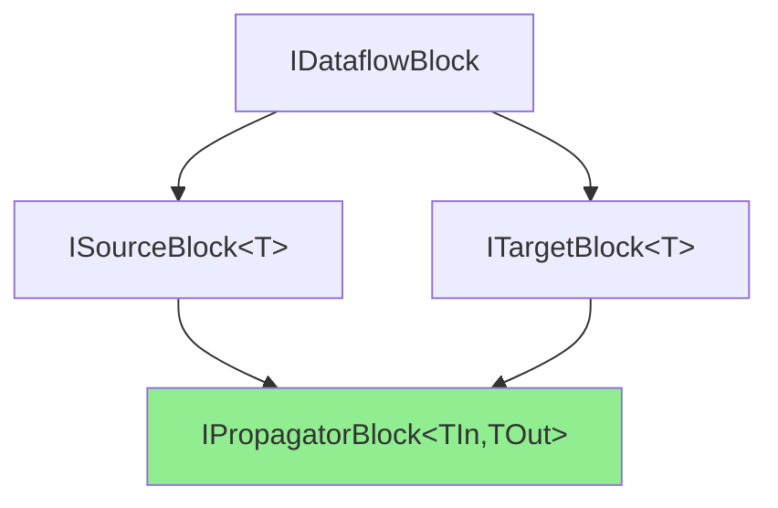
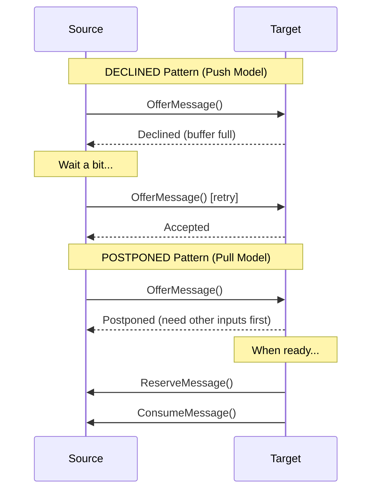
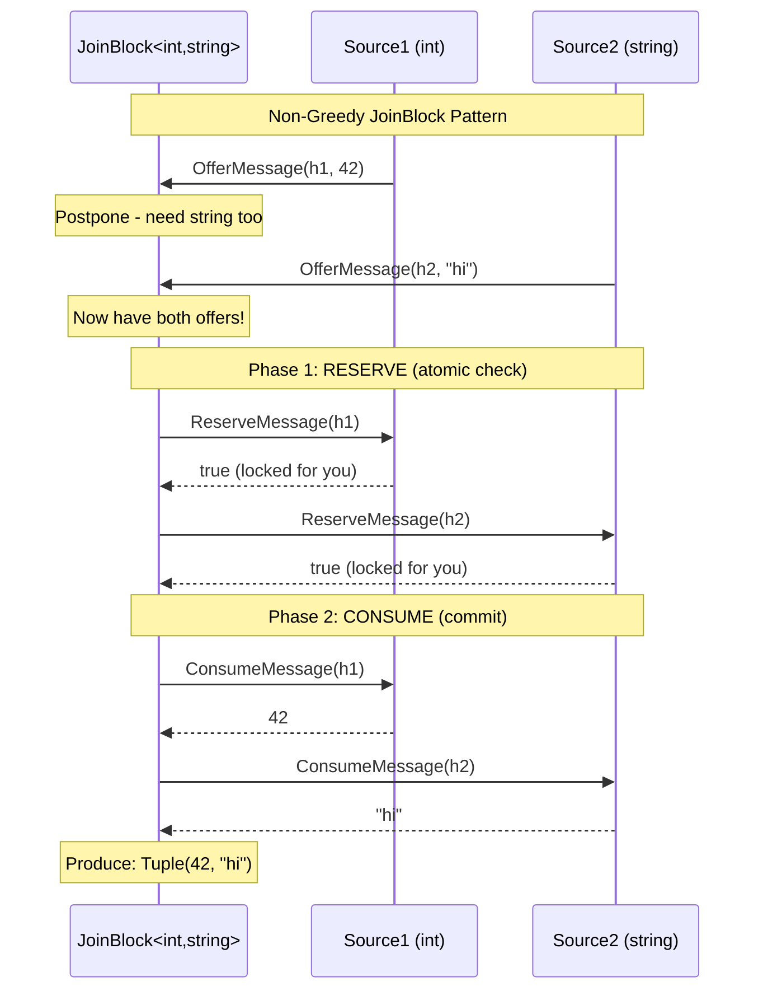
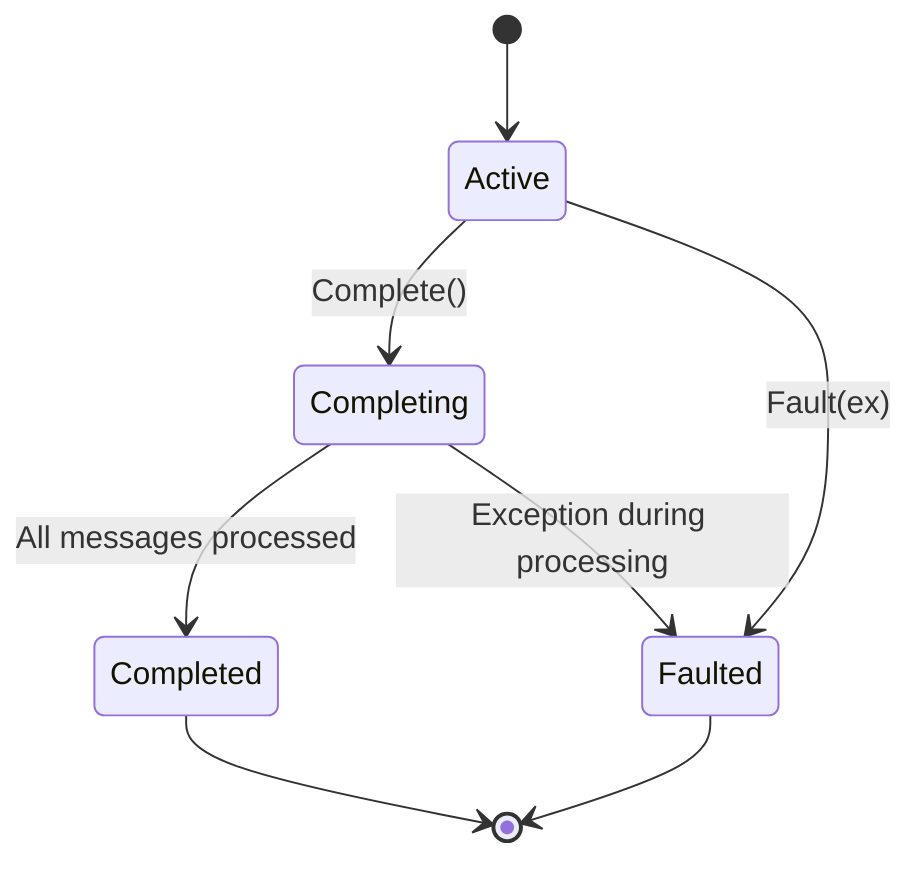

# Learn 10: Custom IPropagatorBlock Implementation

## Overview

While `DataflowBlock.Encapsulate` provides a convenient way to create custom blocks by wrapping existing blocks, sometimes you need full control over block behavior. This requires implementing `IPropagatorBlock<TInput, TOutput>` from scratch by implementing both `ISourceBlock<TOutput>` and `ITargetBlock<TInput>` interfaces.

**When to Build Custom vs Use Encapsulate:**
- ✅ **Use Encapsulate** when: Combining existing blocks, standard dataflow patterns, quick prototyping
- ✅ **Build Custom** when: Non-standard buffering logic, special reservation protocols, custom scheduling, integration with non-dataflow systems

---

## Core Interfaces

### The Interface Hierarchy



**IPropagatorBlock<TInput, TOutput>** combines:
- `ITargetBlock<TInput>` - Receives messages
- `ISourceBlock<TOutput>` - Produces messages
- `IDataflowBlock` - Lifecycle management

---

## ITargetBlock<TInput> Interface

The input side of your block:

```csharp
public interface ITargetBlock<in TInput> : IDataflowBlock
{
    // Offer a message to this block
    DataflowMessageStatus OfferMessage(
        DataflowMessageHeader messageHeader,
        TInput messageValue,
        ISourceBlock<TInput>? source,
        bool consumeToAccept);
}
```

### DataflowMessageStatus Return Values

```csharp
public enum DataflowMessageStatus
{
    Accepted,              // Message accepted and stored
    Declined,              // Message rejected (try later)
    Postponed,             // Message postponed (will reserve later)
    DecliningPermanently,  // Block completed/faulted, don't retry
    NotAvailable          // Message no longer available at source
}
```

#### Understanding Declined vs Postponed

The difference between `Declined` and `Postponed` is critical for implementing correct block behavior:

**`Declined`** - "I can't accept right now, but **try again later**"
- Used for **temporary** rejection (e.g., buffer full, busy processing)
- Source should **retry offering** periodically
- **No reservation** - source keeps trying to push
- Target makes **no commitment** to accept later
- **Push model** - source drives retries

**`Postponed`** - "I can't accept right now, but **I'll pull it when ready**"
- Used for **non-greedy** patterns (e.g., JoinBlock waiting for all inputs)
- Source should **NOT retry** - target will **reserve/consume** when ready
- Implies **reservation protocol** will be used
- Target commits to **pulling the message later** via `ReserveMessage` → `ConsumeMessage`
- **Pull model** - target drives consumption



**When to use `Declined`:**
- ✅ Buffer/queue is at capacity (will drain over time)
- ✅ Backpressure - slowing down producer
- ✅ Simple bounded blocks (BufferBlock, ActionBlock with BoundedCapacity)
- ✅ Rate limiting scenarios

**When to use `Postponed`:**
- ✅ **JoinBlock** in non-greedy mode (wait for all N inputs)
- ✅ **BatchBlock** in non-greedy mode (atomic batch assembly)
- ✅ Need **atomic multi-message** operations
- ✅ **Coordination patterns** (all-or-nothing acceptance)

**Example - JoinBlock non-greedy:**
```csharp
// JoinBlock waits for messages from ALL inputs before accepting any
var join = new JoinBlock<int, string>(
    new GroupingDataflowBlockOptions { Greedy = false });

// When first input offers:
// Target1.OfferMessage(5) → Postponed (waiting for Target2)
// When second input offers:
// Target2.OfferMessage("hi") → Now reserves BOTH atomically:
//   - Target1.ReserveMessage() → Target1.ConsumeMessage() → 5
//   - Target2.ReserveMessage() → Target2.ConsumeMessage() → "hi"
//   - Produces: Tuple(5, "hi")
```

**Rule of thumb:** Use `Declined` for simple backpressure (most custom blocks). Use `Postponed` only when implementing coordination blocks that need atomic multi-source consumption.

---

**Typical OfferMessage Implementation Pattern:**

```csharp
// Method of ITargetBlock interface. Called by upstream nodes (via Post/LinkTo)
// to offer a message to this block for processing.
public DataflowMessageStatus OfferMessage(
    DataflowMessageHeader messageHeader,  // Unique message identifier (struct with long Id)
    TInput messageValue,                   // The message data (used if consumeToAccept=false)
    ISourceBlock<TInput>? source,         // Source block offering message (null if Post())
    bool consumeToAccept)                 // true: must call ConsumeMessage; false: use messageValue directly
{
    // 1. Validate message header (struct can be default/invalid)
    if (!messageHeader.IsValid)
        throw new ArgumentException("Invalid message header");
    
    // 2. Check if block is still accepting (after Complete() or Fault())
    if (_completed)
        return DataflowMessageStatus.DecliningPermanently;  // Tell source: don't retry
    
    // 3. Check buffer capacity (backpressure/bounded capacity)
    if (_buffer.Count >= _boundedCapacity)
        return DataflowMessageStatus.Declined;  // or Postponed for reservation
    
    // 4. If from another block via link, complete the two-phase protocol
    bool consumed = true;
    if (consumeToAccept && source != null)
    {
        // Call source.ConsumeMessage to: (a) honor protocol, (b) get actual value
        // Note: messageValue gets OVERWRITTEN via 'out' parameter
        consumed = source.ConsumeMessage(messageHeader, this, out messageValue);
        if (!consumed)
            return DataflowMessageStatus.NotAvailable;  // Source no longer has it
    }
    // else: messageValue parameter contains the actual value (from Post call)
    
    // 5. Store message and trigger processing
    _buffer.Enqueue(messageValue);
    ProcessMessages();  // Async processing or propagation to targets
    
    return DataflowMessageStatus.Accepted;
}
```

---

## ISourceBlock<TOutput> Interface

The output side of your block:

```csharp
public interface ISourceBlock<out TOutput> : IDataflowBlock
{
    // Link this source to a target block. Returns IDisposable to unlink.
    // Called by user code or internally during pipeline setup.
    IDisposable LinkTo(ITargetBlock<TOutput> target, DataflowLinkOptions linkOptions);
    
    // Consume a previously reserved/offered message. Called by target during two-phase protocol.
    // Returns the message value and sets messageConsumed=true if successful.
    TOutput? ConsumeMessage(DataflowMessageHeader messageHeader,
                            ITargetBlock<TOutput> target,
                            out bool messageConsumed);
    
    // Reserve a message for later consumption (non-greedy pattern).
    // Called by target (e.g., JoinBlock) before committing to accept.
    // Returns true if message reserved successfully.
    bool ReserveMessage(DataflowMessageHeader messageHeader,
                        ITargetBlock<TOutput> target);
    
    // Release a previously reserved message back to available pool.
    // Called if target decides not to consume after reservation.
    void ReleaseReservation(DataflowMessageHeader messageHeader,
                            ITargetBlock<TOutput> target);
}
```

### Message Reservation Protocol

The reservation protocol enables atomic message transfer through a **two-phase commit pattern**.

#### Why Both ReserveMessage AND ConsumeMessage?

The separation of Reserve and Consume solves a critical coordination problem:

**Problem:** A target needs messages from **multiple sources** atomically (all or nothing).

**Without Reservation (naive approach):**
```csharp
// BAD: Race condition!
var msg1 = source1.TryGet();  // Got it!
var msg2 = source2.TryGet();  // Failed! Source2 gave it to someone else
// Now what? msg1 is gone, msg2 unavailable - deadlock!
```

**With Two-Phase Protocol:**
```csharp
// Phase 1: RESERVE (lock without removing)
bool reserved1 = source1.ReserveMessage(header1, this);  // "Hold this for me"
bool reserved2 = source2.ReserveMessage(header2, this);  // "Hold this for me"

if (reserved1 && reserved2)  // Got ALL? Commit!
{
    // Phase 2: CONSUME (actually take the messages)
    var msg1 = source1.ConsumeMessage(header1, this, out _);
    var msg2 = source2.ConsumeMessage(header2, this, out _);
    // Success! Process both atomically
}
else  // Couldn't get ALL? Rollback!
{
    if (reserved1) source1.ReleaseReservation(header1, this);
    if (reserved2) source2.ReleaseReservation(header2, this);
    // All sources free, no deadlock
}
```

**Key Benefits:**

1. **Atomicity** - Get all messages or none (no partial state)
2. **No Deadlock** - Can release reservations if can't get everything
3. **Fair Ordering (FIFO)** - Once reserved, other targets can't "steal" that message while you're coordinating with other sources. Prevents race conditions where Target B grabs a message that Target A saw first but is still gathering its other required inputs.
4. **Coordination** - JoinBlock waits for messages from ALL N inputs without losing them to competing targets

**Real-World Analogy:**
- **Reserve** = "Hold this item at the store while I check if other stores have the matching parts"
- **Consume** = "Okay, I found everything - I'll buy it now"
- **Release** = "Cancel the hold - I couldn't find all the parts I need"

**⚠️ Important: No Reservation Expiration**

The TPL Dataflow reservation protocol has **no built-in timeout or expiration**. Once a message is reserved:
- It stays locked until `ConsumeMessage()` or `ReleaseReservation()` is called
- No automatic cleanup if target crashes or hangs
- **Deadlock risk** if target reserves but never consumes/releases

**This means:**
```csharp
// BAD: Dangerous reservation pattern
source.ReserveMessage(header, this);  // Locks the message
// ... if code crashes here or forgets to consume/release ...
// Message is PERMANENTLY stuck! No other target can get it.
```

**Built-in blocks (JoinBlock, BatchBlock) are carefully designed to always:**
1. Reserve all needed messages
2. Consume if successful, OR release if failed
3. Never leave dangling reservations

**If implementing custom reservation logic:**
- ✅ Always pair `ReserveMessage` with `ConsumeMessage` OR `ReleaseReservation`
- ✅ Use try-finally blocks to ensure cleanup
- ✅ Keep reservation duration minimal (coordination should be fast)
- ✅ Consider timeouts at application level if needed

```csharp
// GOOD: Safe reservation pattern
bool reserved1 = false, reserved2 = false;
try
{
    reserved1 = source1.ReserveMessage(header1, this);
    reserved2 = source2.ReserveMessage(header2, this);
    
    if (reserved1 && reserved2)
    {
        // Consume both
        var msg1 = source1.ConsumeMessage(header1, this, out _);
        var msg2 = source2.ConsumeMessage(header2, this, out _);
        reserved1 = reserved2 = false;  // Consumed, no release needed
    }
}
finally
{
    // Always release if not consumed
    if (reserved1) source1.ReleaseReservation(header1, this);
    if (reserved2) source2.ReleaseReservation(header2, this);
}
```



**When Reservation Protocol is Used:**
- ✅ **JoinBlock** in non-greedy mode (must get messages from ALL inputs)
- ✅ **BatchBlock** in non-greedy mode (atomic batch of N items)
- ✅ Any custom block requiring **atomic multi-source** coordination
- ❌ **NOT needed** for greedy blocks (BufferBlock, ActionBlock, etc.)

---

## IDataflowBlock Interface

Common lifecycle methods:

```csharp
public interface IDataflowBlock
{
    // Task that completes when block is done
    Task Completion { get; }
    
    // Signal no more messages will be accepted
    void Complete();
    
    // Fault the block with an exception
    void Fault(Exception exception);
}
```

**Completion States:**



---

## Minimal Custom Block Example

A simple pass-through block (like BufferBlock but simpler):

```csharp
public class SimplePassthroughBlock<T> : IPropagatorBlock<T, T>
{
    // Internal state
    private readonly Queue<T> _buffer = new();                              // FIFO buffer for messages
    private readonly List<ITargetBlock<T>> _targets = new();                // Linked downstream targets
    private readonly TaskCompletionSource<VoidResult> _completion = new();  // Signals completion to callers
    private bool _decliningPermanently = false;                             // Set when Complete() or Fault() called
    private long _nextMessageId = 0;                                        // Counter for unique message IDs
    
    // === ITargetBlock Implementation ===
    // This is the INPUT side - receives messages from upstream
    
    public DataflowMessageStatus OfferMessage(
        DataflowMessageHeader messageHeader,
        T messageValue,
        ISourceBlock<T>? source,
        bool consumeToAccept)
    {
        // Validate header (struct can be default/invalid)
        if (!messageHeader.IsValid)
            throw new ArgumentException("Invalid header");
        
        if (_decliningPermanently)
            return DataflowMessageStatus.DecliningPermanently;
        
        // Consume from source if needed
        if (consumeToAccept && source != null)
        {
            bool consumed = source.ConsumeMessage(messageHeader, this, out messageValue!);
            if (!consumed)
                return DataflowMessageStatus.NotAvailable;
        }
        
        lock (_buffer)
        {
            _buffer.Enqueue(messageValue);
        }
        
        // Try to propagate to targets
        PropagateMessages();
        
        return DataflowMessageStatus.Accepted;
    }
    
    // === ISourceBlock Implementation ===
    // This is the OUTPUT side - sends messages to downstream targets
    
    public IDisposable LinkTo(ITargetBlock<T> target, DataflowLinkOptions linkOptions)
    {
        if (target == null) throw new ArgumentNullException(nameof(target));
        
        // Add target to list of linked blocks
        lock (_targets)
        {
            _targets.Add(target);
        }
        
        // Try to propagate any buffered messages immediately
        PropagateMessages();
        
        // Return IDisposable that removes link when disposed
        return new Unlinker(() =>
        {
            lock (_targets)
            {
                _targets.Remove(target);
            }
        });
    }
    
    // Called by downstream target to consume a message during two-phase protocol
    public T? ConsumeMessage(DataflowMessageHeader messageHeader,
                            ITargetBlock<T> target,
                            out bool messageConsumed)
    {
        // Simple implementation: not supporting reservation protocol
        // A full implementation would lookup message by header.Id and return it
        messageConsumed = false;
        return default;
    }
    
    // Called by downstream target to reserve a message (non-greedy pattern)
    public bool ReserveMessage(DataflowMessageHeader messageHeader,
                              ITargetBlock<T> target)
    {
        // Simple implementation: not supporting reservation protocol
        // A full implementation would mark message as reserved in internal dictionary
        return false;
    }
    
    // Called by downstream target to release a previously reserved message
    public void ReleaseReservation(DataflowMessageHeader messageHeader,
                                  ITargetBlock<T> target)
    {
        // Simple implementation: not supporting reservation protocol
        // A full implementation would unmark message, making it available again
    }
    
    // === IDataflowBlock Implementation ===
    // Common lifecycle management shared by all dataflow blocks
    
    // Task that completes when block finishes processing (Completed, Faulted, or Canceled)
    public Task Completion => _completion.Task;
    
    // Signal that no more messages will be accepted. Block drains buffer before completing.
    public void Complete()
    {
        lock (_buffer)
        {
            _decliningPermanently = true;  // Future OfferMessage calls return DecliningPermanently
        }
        
        PropagateCompletion();  // Check if we can complete now (buffer empty)
    }
    
    // Fault the block with an exception. Block stops processing immediately.
    public void Fault(Exception exception)
    {
        lock (_buffer)
        {
            _decliningPermanently = true;  // Stop accepting new messages
        }
        
        // Transition Completion task to Faulted state
        _completion.TrySetException(exception);
        
        // Propagate fault to all linked targets (if PropagateCompletion=true)
        lock (_targets)
        {
            foreach (var target in _targets)
            {
                target.Fault(exception);
            }
        }
    }
    
    // === Helper Methods ===
    
    // Try to offer buffered messages to linked targets
    private void PropagateMessages()
    {
        lock (_buffer)
        {
            while (_buffer.Count > 0)
            {
                var message = _buffer.Peek();  // Look at head without removing
                bool offered = false;
                
                lock (_targets)
                {
                    // Offer to each target until one accepts
                    foreach (var target in _targets.ToList())  // ToList to avoid modification issues
                    {
                        var header = new DataflowMessageHeader(++_nextMessageId);  // Create unique ID
                        // consumeToAccept=false because we already own the message
                        var status = target.OfferMessage(header, message, this, consumeToAccept: false);
                        
                        if (status == DataflowMessageStatus.Accepted)
                        {
                            offered = true;
                            _buffer.Dequeue();  // Remove from buffer only after accepted
                            break;  // Message handled, move to next
                        }
                        // else: Declined/Postponed - try next target or keep in buffer
                    }
                }
                
                if (!offered)
                    break; // No target accepted, keep in buffer for later
            }
        }
        
        PropagateCompletion();  // Check if block can complete now
    }
    
    // ⚠️ IMPORTANT LIMITATION OF THIS SIMPLE IMPLEMENTATION:
    // This PropagateMessages() has no retry mechanism! If all targets return Declined,
    // messages stay in buffer until:
    //   1. A new message arrives (triggers another PropagateMessages call)
    //   2. A new target is linked (LinkTo triggers PropagateMessages)
    //   3. Complete() is called (triggers final PropagateMessages)
    //
    // Real production blocks solve this with:
    //   - Async processing loops that continuously retry
    //   - Timer-based polling when targets are busy
    //   - Event-driven notifications when targets become available
    //   - Task schedulers for efficient async propagation
    //
    // For learning purposes, this simplified version demonstrates the protocol
    // but would need enhancement for production use with bounded capacity targets.
    
    // Check if block can complete (no more messages and Complete() was called)
    private void PropagateCompletion()
    {
        bool shouldComplete;
        lock (_buffer)
        {
            // Complete only when: (1) Complete() called AND (2) buffer drained
            shouldComplete = _decliningPermanently && _buffer.Count == 0;
        }
        
        if (shouldComplete)
        {
            // Transition Completion task to RanToCompletion state (idempotent)
            _completion.TrySetResult(default);
            
            // Propagate completion to all linked targets
            lock (_targets)
            {
                foreach (var target in _targets)
                {
                    target.Complete();  // Cascade completion downstream
                }
            }
        }
    }
    
    // Helper for unlinking
    private class Unlinker : IDisposable
    {
        private readonly Action _unlinkAction;
        public Unlinker(Action unlinkAction) => _unlinkAction = unlinkAction;
        public void Dispose() => _unlinkAction();
    }
    
    private struct VoidResult { }
}
```

---

## Key Implementation Patterns

### 1. Thread Safety

**Critical sections need locking:**
```csharp
private readonly object _lock = new();

public DataflowMessageStatus OfferMessage(...)
{
    lock (_lock)
    {
        if (_completed) return DataflowMessageStatus.DecliningPermanently;
        _buffer.Enqueue(messageValue);
    }
    // Process outside lock to avoid deadlocks
    ProcessAsync();
    return DataflowMessageStatus.Accepted;
}
```

**⚠️ Avoid holding locks during:**
- Calling other blocks (potential deadlock)
- Async operations
- User callbacks

### 2. Message Header Management

```csharp
private long _nextMessageId = 0;

private DataflowMessageHeader CreateMessageHeader()
{
    var id = Interlocked.Increment(ref _nextMessageId);
    return new DataflowMessageHeader(id);
}
```

**Valid vs Invalid Headers:**
```csharp
var header = new DataflowMessageHeader(1);      // Valid
var invalidHeader = default(DataflowMessageHeader); // Invalid

if (!header.IsValid)
    throw new ArgumentException("Invalid header");
```

### 3. Completion Propagation

```csharp
private void PropagateCompletion()
{
    bool shouldComplete = _decliningPermanently && _outputQueue.Count == 0;
    
    if (shouldComplete && !_completion.Task.IsCompleted)
    {
        _completion.TrySetResult(default);
        
        // Complete linked targets
        foreach (var target in _targets)
        {
            target.Complete();
        }
    }
}
```

**Completion Checklist:**
- ✅ Set `_decliningPermanently = true` when Complete() called
- ✅ Wait for output queue to drain before completing
- ✅ Propagate completion to linked targets
- ✅ Use `TrySetResult/TrySetException` (idempotent)

### 4. Bounded Capacity

```csharp
private readonly int _boundedCapacity;

public DataflowMessageStatus OfferMessage(...)
{
    lock (_lock)
    {
        if (_buffer.Count >= _boundedCapacity)
            return DataflowMessageStatus.Declined;
        
        _buffer.Enqueue(messageValue);
    }
    return DataflowMessageStatus.Accepted;
}
```

---

## Advanced: Reservation Support

Implementing full reservation protocol (for non-greedy scenarios):

```csharp
private readonly Dictionary<long, T> _reservedMessages = new();
private readonly Dictionary<long, T> _pendingMessages = new();

public bool ReserveMessage(
    DataflowMessageHeader messageHeader,
    ITargetBlock<T> target)
{
    lock (_lock)
    {
        if (_pendingMessages.TryGetValue(messageHeader.Id, out var message))
        {
            _reservedMessages[messageHeader.Id] = message;
            return true;
        }
        return false;
    }
}

public T? ConsumeMessage(
    DataflowMessageHeader messageHeader,
    ITargetBlock<T> target,
    out bool messageConsumed)
{
    lock (_lock)
    {
        if (_reservedMessages.TryGetValue(messageHeader.Id, out var message))
        {
            _reservedMessages.Remove(messageHeader.Id);
            _pendingMessages.Remove(messageHeader.Id);
            messageConsumed = true;
            return message;
        }
        
        messageConsumed = false;
        return default;
    }
}

public void ReleaseReservation(
    DataflowMessageHeader messageHeader,
    ITargetBlock<T> target)
{
    lock (_lock)
    {
        _reservedMessages.Remove(messageHeader.Id);
        // Message back in _pendingMessages, can be offered again
    }
}
```

---

## Practical Example: Rate-Limiting Block

A custom block that limits throughput to N messages per second:

```csharp
public class RateLimitBlock<T> : IPropagatorBlock<T, T>
{
    private readonly Queue<T> _buffer = new();
    private readonly List<ITargetBlock<T>> _targets = new();
    private readonly TaskCompletionSource _completion = new();
    private readonly Timer _timer;
    private readonly int _messagesPerSecond;
    private readonly object _lock = new();
    private bool _decliningPermanently = false;
    private long _nextMessageId = 0;
    
    public RateLimitBlock(int messagesPerSecond)
    {
        _messagesPerSecond = messagesPerSecond;
        var interval = TimeSpan.FromSeconds(1.0 / messagesPerSecond);
        _timer = new Timer(_ => ProcessNextMessage(), null, interval, interval);
    }
    
    public DataflowMessageStatus OfferMessage(
        DataflowMessageHeader messageHeader,
        T messageValue,
        ISourceBlock<T>? source,
        bool consumeToAccept)
    {
        if (!messageHeader.IsValid)
            throw new ArgumentException("Invalid header");
        
        lock (_lock)
        {
            if (_decliningPermanently)
                return DataflowMessageStatus.DecliningPermanently;
            
            if (consumeToAccept && source != null)
            {
                bool consumed = source.ConsumeMessage(messageHeader, this, out messageValue!);
                if (!consumed)
                    return DataflowMessageStatus.NotAvailable;
            }
            
            _buffer.Enqueue(messageValue);
        }
        
        return DataflowMessageStatus.Accepted;
    }
    
    private void ProcessNextMessage()
    {
        T? message;
        bool hasMessage;
        
        lock (_lock)
        {
            hasMessage = _buffer.TryDequeue(out message);
        }
        
        if (hasMessage && message != null)
        {
            OfferToTargets(message);
        }
        
        CheckCompletion();
    }
    
    private void OfferToTargets(T message)
    {
        ITargetBlock<T>[] targetsCopy;
        lock (_lock)
        {
            targetsCopy = _targets.ToArray();
        }
        
        foreach (var target in targetsCopy)
        {
            var header = new DataflowMessageHeader(Interlocked.Increment(ref _nextMessageId));
            var status = target.OfferMessage(header, message, this, consumeToAccept: false);
            
            if (status == DataflowMessageStatus.Accepted)
                break;
        }
    }
    
    public IDisposable LinkTo(ITargetBlock<T> target, DataflowLinkOptions linkOptions)
    {
        lock (_lock)
        {
            _targets.Add(target);
        }
        
        return new Unlinker(() =>
        {
            lock (_lock)
            {
                _targets.Remove(target);
            }
        });
    }
    
    public Task Completion => _completion.Task;
    
    public void Complete()
    {
        lock (_lock)
        {
            _decliningPermanently = true;
        }
        CheckCompletion();
    }
    
    private void CheckCompletion()
    {
        bool shouldComplete;
        lock (_lock)
        {
            shouldComplete = _decliningPermanently && _buffer.Count == 0;
        }
        
        if (shouldComplete)
        {
            _timer.Dispose();
            _completion.TrySetResult();
            
            ITargetBlock<T>[] targetsCopy;
            lock (_lock)
            {
                targetsCopy = _targets.ToArray();
            }
            
            foreach (var target in targetsCopy)
            {
                target.Complete();
            }
        }
    }
    
    public void Fault(Exception exception)
    {
        lock (_lock)
        {
            _decliningPermanently = true;
        }
        
        _timer.Dispose();
        _completion.TrySetException(exception);
        
        ITargetBlock<T>[] targetsCopy;
        lock (_lock)
        {
            targetsCopy = _targets.ToArray();
        }
        
        foreach (var target in targetsCopy)
        {
            target.Fault(exception);
        }
    }
    
    // Simplified: not supporting reservation
    public T? ConsumeMessage(DataflowMessageHeader messageHeader,
                            ITargetBlock<T> target,
                            out bool messageConsumed)
    {
        messageConsumed = false;
        return default;
    }
    
    public bool ReserveMessage(DataflowMessageHeader messageHeader,
                              ITargetBlock<T> target) => false;
    
    public void ReleaseReservation(DataflowMessageHeader messageHeader,
                                  ITargetBlock<T> target) { }
    
    private class Unlinker : IDisposable
    {
        private readonly Action _unlinkAction;
        public Unlinker(Action unlinkAction) => _unlinkAction = unlinkAction;
        public void Dispose() => _unlinkAction();
    }
}
```

**Usage:**
```csharp
var rateLimiter = new RateLimitBlock<int>(messagesPerSecond: 10);
var printer = new ActionBlock<int>(x => Console.WriteLine($"Processing: {x}"));

rateLimiter.LinkTo(printer);

for (int i = 0; i < 100; i++)
{
    rateLimiter.Post(i);
}

rateLimiter.Complete();
await rateLimiter.Completion;
// Output rate limited to 10 messages/second
```

---

## Testing Custom Blocks

### Unit Test Checklist

```csharp
[Test]
public async Task CustomBlock_AcceptsAndPropagatesMessages()
{
    var block = new SimplePassthroughBlock<int>();
    var received = new List<int>();
    var action = new ActionBlock<int>(x => received.Add(x));
    
    block.LinkTo(action);
    
    // Test message acceptance
    block.Post(1);
    block.Post(2);
    block.Post(3);
    
    block.Complete();
    await block.Completion;
    await action.Completion;
    
    Assert.Equal(new[] { 1, 2, 3 }, received);
}

[Test]
public async Task CustomBlock_DeclinesAfterCompletion()
{
    var block = new SimplePassthroughBlock<int>();
    block.Complete();
    
    bool accepted = block.Post(1);
    
    Assert.False(accepted);
    await block.Completion;
}

[Test]
public async Task CustomBlock_PropagatesCompletion()
{
    var block = new SimplePassthroughBlock<int>();
    var action = new ActionBlock<int>(_ => { });
    
    block.LinkTo(action, new DataflowLinkOptions { PropagateCompletion = true });
    
    block.Complete();
    await block.Completion;
    await action.Completion; // Should complete automatically
}

[Test]
public async Task CustomBlock_PropagatesFault()
{
    var block = new SimplePassthroughBlock<int>();
    var action = new ActionBlock<int>(_ => { });
    
    block.LinkTo(action, new DataflowLinkOptions { PropagateCompletion = true });
    
    var exception = new InvalidOperationException("Test fault");
    block.Fault(exception);
    
    await Assert.ThrowsAsync<InvalidOperationException>(() => block.Completion);
    await Assert.ThrowsAsync<InvalidOperationException>(() => action.Completion);
}
```

---

## Common Mistakes & Best Practices

### ❌ Common Mistakes

1. **Holding locks during async operations**
   ```csharp
   // BAD
   lock (_lock)
   {
       await ProcessAsync(); // Deadlock risk!
   }
   
   // GOOD
   T item;
   lock (_lock) { item = _queue.Dequeue(); }
   await ProcessAsync(item);
   ```

2. **Not validating message headers**
   ```csharp
   // BAD
   public DataflowMessageStatus OfferMessage(
       DataflowMessageHeader messageHeader, ...)
   {
       // Missing validation
   }
   
   // GOOD
   if (!messageHeader.IsValid)
       throw new ArgumentException("Invalid header");
   ```

3. **Forgetting completion propagation**
   ```csharp
   // BAD
   public void Complete()
   {
       _completed = true;
       _completion.SetResult(default); // Wrong: might have pending messages
   }
   
   // GOOD
   public void Complete()
   {
       _decliningPermanently = true;
       CheckCompletion(); // Wait for queue to drain
   }
   ```

4. **Not copying target list before iteration**
   ```csharp
   // BAD (can throw if list modified during iteration)
   foreach (var target in _targets)
       target.OfferMessage(...);
   
   // GOOD
   var targetsCopy = _targets.ToArray();
   foreach (var target in targetsCopy)
       target.OfferMessage(...);
   ```

### ✅ Best Practices

1. **Keep locks minimal and avoid nesting**
2. **Use `TrySetResult/TrySetException` (idempotent)**
3. **Always check `IsValid` on message headers**
4. **Document thread-safety guarantees**
5. **Test completion, fault propagation, and edge cases**
6. **Consider using `DataflowBlock.Encapsulate` first** - only build custom when truly needed

---

## When to Build Custom vs Use Encapsulate

| Scenario | Recommendation |
|----------|---------------|
| Combining existing blocks | ✅ Use Encapsulate |
| Standard buffering needs | ✅ Use Encapsulate |
| Need reservation protocol | ⚠️ Build Custom |
| Custom scheduling logic | ⚠️ Build Custom |
| Integration with legacy systems | ⚠️ Build Custom |
| Exotic buffering (priority queue, LRU) | ⚠️ Build Custom |
| Performance-critical tight loop | ⚠️ Build Custom |
| Learning exercise | ✅ Build Custom |

**Rule of Thumb:** Start with `Encapsulate`. Build custom only when you need behavior that can't be achieved by composing built-in blocks.

---

## Summary

Building custom `IPropagatorBlock` implementations gives you maximum control but requires:

1. **Implementing three interfaces**: `ITargetBlock`, `ISourceBlock`, `IDataflowBlock`
2. **Thread-safe state management** with careful locking
3. **Message header tracking** with unique IDs
4. **Completion/fault propagation** to linked targets
5. **Optional reservation protocol** for non-greedy scenarios

**Key Takeaways:**
- Custom blocks are powerful but complex - use `Encapsulate` when possible
- Thread safety is critical - never hold locks during async operations
- Message headers must be unique and validated
- Completion requires draining buffers before setting `Completion` task
- Test exhaustively: acceptance, decline, completion, faults, threading

---

## Additional Resources

**Official Documentation:**
- [ITargetBlock<TInput> Interface](https://learn.microsoft.com/en-us/dotnet/api/system.threading.tasks.dataflow.itargetblock-1)
- [ISourceBlock<TOutput> Interface](https://learn.microsoft.com/en-us/dotnet/api/system.threading.tasks.dataflow.isourceblock-1)
- [IPropagatorBlock<TInput,TOutput> Interface](https://learn.microsoft.com/en-us/dotnet/api/system.threading.tasks.dataflow.ipropagatorblock-2)

**Articles & Discussions:**
- [Building Custom Dataflow Blocks (Stephen Toub)](https://devblogs.microsoft.com/pfxteam/building-custom-dataflow-blocks/)
- [TPL Dataflow - Custom Blocks (Stack Overflow)](https://stackoverflow.com/questions/tagged/tpl-dataflow)

**Video:**
- [Advanced TPL Dataflow Patterns](https://channel9.msdn.com/Shows/Going+Deep/Stephen-Toub-Inside-TPL-Dataflow) - Stephen Toub explains internal implementation

---

## Exercise Challenge

**Build a PriorityBlock<T>:**
- Accepts items with integer priority
- Propagates highest priority items first
- Supports bounded capacity
- Proper completion propagation

**Bonus:** Add reservation protocol support for non-greedy consumption.

Try implementing this before moving to the quiz! 🚀
