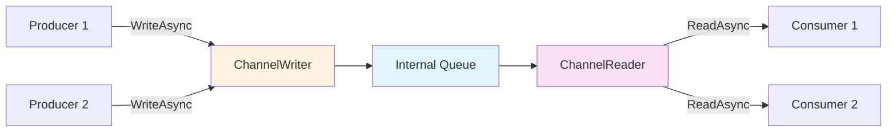

# Learn 11: Producer-Consumer Patterns Beyond Dataflow

## Introduction

After mastering TPL Dataflow's rich pipeline capabilities, it's time to explore **System.Threading.Channels** — a lighter, faster alternative focused specifically on producer-consumer scenarios. While Dataflow excels at complex multi-stage pipelines with transformations and routing, Channels provide a simpler, more performant solution when you need straightforward data passing between producers and consumers.

**Key Insight:** Channels are the storage mechanism; Dataflow is storage + processing pipeline. Understanding when to use each is crucial for building efficient concurrent systems.

---

## 1. System.Threading.Channels Fundamentals

### What Are Channels?

Channels provide **thread-safe, asynchronous queues** for passing data between producers and consumers. Think of them as a modern, high-performance replacement for `BlockingCollection<T>`.

```csharp
using System.Threading.Channels;

// Create unbounded channel
var channel = Channel.CreateUnbounded<int>();

// Producer writes to channel
await channel.Writer.WriteAsync(42);

// Consumer reads from channel
int value = await channel.Reader.ReadAsync();
```

### Channel Architecture



**Key Components:**
- **`ChannelWriter<T>`** - Producer interface for writing data
- **`ChannelReader<T>`** - Consumer interface for reading data
- **Internal Queue** - Thread-safe storage (bounded or unbounded)

---

## 2. Channel Types: Bounded vs Unbounded

### Unbounded Channels

**No capacity limit** - grows indefinitely until memory exhausted.

```csharp
// Create unbounded channel
var channel = Channel.CreateUnbounded<string>();

// Producer can always write immediately (no backpressure)
await channel.Writer.WriteAsync("message"); // Never blocks
```

**Use when:**
- ✅ Producer rate is generally lower than consumer rate
- ✅ Memory consumption is acceptable
- ✅ Simplicity is priority

**Risk:** Memory exhaustion if consumers can't keep up!

---

### Bounded Channels

**Fixed capacity** - blocks producers when full (natural backpressure).

```csharp
// Create bounded channel with capacity of 100
var channel = Channel.CreateBounded<string>(100);

// When full, WriteAsync blocks until space available
await channel.Writer.WriteAsync("message"); // May block if queue full
```

**Configuration Options:**

```csharp
var options = new BoundedChannelOptions(capacity: 100)
{
    FullMode = BoundedChannelFullMode.Wait, // Default: block producer
    SingleReader = false,  // Optimize for multiple consumers
    SingleWriter = false   // Optimize for multiple producers
};

var channel = Channel.CreateBounded<string>(options);
```

**`FullMode` Behaviors:**

| Mode | Behavior When Full |
|------|-------------------|
| **`Wait`** (default) | `WriteAsync()` blocks until space available |
| **`DropWrite`** | Silently discard new item, return success |
| **`DropOldest`** | Discard oldest item, add new one |
| **`DropNewest`** | Discard newest item (keep trying to add) |

```csharp
// Example: Drop oldest when queue full (ring buffer behavior)
var options = new BoundedChannelOptions(10)
{
    FullMode = BoundedChannelFullMode.DropOldest
};
var channel = Channel.CreateBounded<LogEntry>(options);
```

---

## 3. Reading Patterns

### Pattern 1: `await foreach` with `ReadAllAsync()`

**Best practice** for consuming all items until channel completes.

```csharp
// Consumer
await foreach (var item in channel.Reader.ReadAllAsync())
{
    Console.WriteLine($"Processing: {item}");
}
// Loop exits when channel.Writer.Complete() called
```

**Why use this?**
- ✅ Clean, idiomatic C# 8.0+ syntax
- ✅ Automatically handles completion
- ✅ Supports `CancellationToken`

---

### Pattern 2: `while` + `WaitToReadAsync()`

Manual loop with explicit availability check.

```csharp
while (await channel.Reader.WaitToReadAsync())
{
    while (channel.Reader.TryRead(out var item))
    {
        Console.WriteLine($"Processing: {item}");
    }
}
```

**When to use:**
- Need batch processing (read multiple items per iteration)
- Custom termination logic

---

### Pattern 3: `ReadAsync()` for Single Items

Direct read (blocks if empty).

```csharp
try
{
    var item = await channel.Reader.ReadAsync(cancellationToken);
    Process(item);
}
catch (ChannelClosedException)
{
    // Channel completed and drained
}
```

---

## 4. Writing & Completion

### Writing Data

```csharp
// Async write (preferred)
await channel.Writer.WriteAsync(42);

// Try write (non-blocking)
if (channel.Writer.TryWrite(42))
{
    Console.WriteLine("Written immediately");
}
else
{
    Console.WriteLine("Queue full, item not written");
}
```

**TryWrite vs WriteAsync:**
- **`TryWrite`** - Returns `false` if bounded channel full (never blocks)
- **`WriteAsync`** - Blocks if bounded channel full (respects backpressure)

---

### Signaling Completion

```csharp
// Producer signals: "No more data coming"
channel.Writer.Complete();

// Or complete with exception
channel.Writer.Complete(new InvalidOperationException("Failed"));

// Check completion status
if (channel.Reader.Completion.IsCompleted)
{
    Console.WriteLine("Channel completed");
}
```

**Critical:** Always call `Complete()` or consumers will hang forever!

---

## 5. Channels vs Dataflow: When to Use Each

### System.Threading.Channels

**Use when:**
- ✅ Simple producer-consumer scenarios
- ✅ Performance is critical (10x faster than Dataflow for basic queuing)
- ✅ You need explicit control over buffering
- ✅ Single-stage data flow (A → B)
- ✅ Async streaming with `IAsyncEnumerable<T>`

**Example:** Log aggregation, background job queue, event buffer

```csharp
// Channels shine here: simple, fast producer-consumer
var channel = Channel.CreateBounded<LogEntry>(1000);

// Producer (web requests)
await channel.Writer.WriteAsync(new LogEntry("Request received"));

// Consumer (background writer)
await foreach (var log in channel.Reader.ReadAllAsync())
{
    await File.AppendAllTextAsync("log.txt", log.Message);
}
```

---

### TPL Dataflow

**Use when:**
- ✅ Multi-stage pipelines with transformations
- ✅ Complex routing/branching logic
- ✅ Need built-in block types (BatchBlock, JoinBlock, etc.)
- ✅ Declarative pipeline composition
- ✅ Completion propagation across stages

**Example:** Data ETL pipeline, image processing pipeline

```csharp
// Dataflow excels here: multi-stage transformation
var fetchBlock = new TransformBlock<int, string>(async id => 
    await FetchDataAsync(id));
    
var processBlock = new TransformBlock<string, ProcessedData>(
    data => ProcessData(data));
    
var saveBlock = new ActionBlock<ProcessedData>(async data => 
    await SaveAsync(data));

fetchBlock.LinkTo(processBlock, new DataflowLinkOptions { PropagateCompletion = true });
processBlock.LinkTo(saveBlock, new DataflowLinkOptions { PropagateCompletion = true });
```

---

### Comparison Table

| Feature | Channels | Dataflow |
|---------|----------|----------|
| **Primary Focus** | Storage (queue) | Storage + Processing pipeline |
| **Performance** | ⚡ Faster (simple scenarios) | Slower (richer features) |
| **Pipeline Support** | ❌ Manual composition | ✅ Built-in linking |
| **Block Types** | ❌ None (DIY) | ✅ 10+ specialized blocks |
| **Completion Propagation** | ❌ Manual | ✅ Automatic (with options) |
| **Batching** | ❌ Manual | ✅ `BatchBlock` |
| **Joining** | ❌ Manual | ✅ `JoinBlock` |
| **Routing** | ❌ Manual | ✅ Predicate-based linking |
| **Bounded Capacity** | ✅ Built-in | ✅ Per-block options |
| **Backpressure** | ✅ Natural (bounded) | ✅ Configurable |
| **Learning Curve** | 🟢 Simple | 🟡 Moderate |

---

## 6. Advanced Channel Patterns

### Pattern 1: Multiple Producers, Single Consumer

```csharp
var channel = Channel.CreateBounded<WorkItem>(100);

// Multiple producers
var producers = Enumerable.Range(0, 5).Select(id => Task.Run(async () =>
{
    for (int i = 0; i < 10; i++)
    {
        await channel.Writer.WriteAsync(new WorkItem(id, i));
        await Task.Delay(100);
    }
}));

// Single consumer
var consumer = Task.Run(async () =>
{
    await foreach (var item in channel.Reader.ReadAllAsync())
    {
        Console.WriteLine($"Producer {item.ProducerId}: Item {item.ItemId}");
    }
});

// Wait for all producers, then signal completion
await Task.WhenAll(producers);
channel.Writer.Complete();
await consumer;
```

**Key:** Coordinate producer completion before calling `Complete()`.

---

### Pattern 2: Single Producer, Multiple Consumers

```csharp
var channel = Channel.CreateUnbounded<int>();

// Single producer
var producer = Task.Run(async () =>
{
    for (int i = 0; i < 100; i++)
    {
        await channel.Writer.WriteAsync(i);
    }
    channel.Writer.Complete();
});

// Multiple consumers (competing)
var consumers = Enumerable.Range(0, 3).Select(id => Task.Run(async () =>
{
    await foreach (var item in channel.Reader.ReadAllAsync())
    {
        Console.WriteLine($"Consumer {id} processing {item}");
        await Task.Delay(50); // Simulate work
    }
}));

await Task.WhenAll(consumers);
```

**Behavior:** Items distributed across consumers (competing, not broadcasting).

---

### Pattern 3: Fan-Out (Broadcasting)

Channels don't natively support broadcasting. Use multiple channels:

```csharp
public class BroadcastChannel<T>
{
    private readonly List<Channel<T>> _subscribers = new();
    
    public ChannelReader<T> Subscribe()
    {
        var channel = Channel.CreateUnbounded<T>();
        _subscribers.Add(channel);
        return channel.Reader;
    }
    
    public async Task WriteAsync(T item)
    {
        foreach (var channel in _subscribers)
        {
            await channel.Writer.WriteAsync(item);
        }
    }
    
    public void Complete()
    {
        foreach (var channel in _subscribers)
        {
            channel.Writer.Complete();
        }
    }
}
```

**Alternative:** Use `BroadcastBlock` from Dataflow for native broadcasting!

---

### Pattern 4: Async Streaming with `IAsyncEnumerable<T>`

Expose channel as async stream:

```csharp
public async IAsyncEnumerable<LogEntry> StreamLogsAsync(
    [EnumeratorCancellation] CancellationToken ct = default)
{
    var channel = Channel.CreateUnbounded<LogEntry>();
    
    // Start background producer
    _ = Task.Run(async () =>
    {
        await foreach (var entry in GetLogEntriesAsync())
        {
            await channel.Writer.WriteAsync(entry, ct);
        }
        channel.Writer.Complete();
    });
    
    // Stream to caller
    await foreach (var entry in channel.Reader.ReadAllAsync(ct))
    {
        yield return entry;
    }
}

// Consumer
await foreach (var log in StreamLogsAsync())
{
    Console.WriteLine(log.Message);
}
```

---

## 7. Backpressure Strategies

### Strategy 1: Bounded Channel (Blocking)

Producer waits when queue full.

```csharp
var channel = Channel.CreateBounded<T>(capacity: 100);
await channel.Writer.WriteAsync(item); // Blocks if full
```

**Pro:** Simple, prevents memory exhaustion  
**Con:** Producers blocked (may reduce throughput)

---

### Strategy 2: Drop Policies

Discard items instead of blocking.

```csharp
var options = new BoundedChannelOptions(100)
{
    FullMode = BoundedChannelFullMode.DropOldest // Ring buffer
};
var channel = Channel.CreateBounded<T>(options);
```

**Use case:** Real-time metrics (old data less valuable)

---

### Strategy 3: TryWrite with Fallback

Non-blocking write with custom handling.

```csharp
if (!channel.Writer.TryWrite(item))
{
    // Queue full - handle gracefully
    await LogToFileAsync(item); // Fallback storage
    _droppedCount++;
}
```

---

### Strategy 4: Adaptive Producer Throttling

Slow down producer based on queue depth.

```csharp
while (true)
{
    var item = ProduceItem();
    
    await channel.Writer.WriteAsync(item);
    
    // Check queue depth (if exposed via custom wrapper)
    if (queueDepth > 80)
    {
        await Task.Delay(10); // Throttle producer
    }
}
```

---

## 8. Real-World Example: High-Performance Log Aggregator

```csharp
using System.Threading.Channels;

public class LogAggregator : IAsyncDisposable
{
    private readonly Channel<LogEntry> _channel;
    private readonly Task _consumerTask;
    private readonly CancellationTokenSource _cts = new();
    
    public LogAggregator(int bufferSize = 1000)
    {
        _channel = Channel.CreateBounded<LogEntry>(new BoundedChannelOptions(bufferSize)
        {
            FullMode = BoundedChannelFullMode.Wait,
            SingleReader = true // Optimization: one consumer
        });
        
        _consumerTask = Task.Run(ConsumeLogsAsync);
    }
    
    // Producer API (called by application threads)
    public async ValueTask LogAsync(string message, LogLevel level = LogLevel.Info)
    {
        var entry = new LogEntry(DateTime.UtcNow, level, message);
        
        // Non-blocking attempt
        if (!_channel.Writer.TryWrite(entry))
        {
            // Fallback: wait (with timeout to prevent deadlock)
            using var cts = new CancellationTokenSource(TimeSpan.FromSeconds(1));
            try
            {
                await _channel.Writer.WriteAsync(entry, cts.Token);
            }
            catch (OperationCanceledException)
            {
                // Queue full for >1 second - discard (or write to emergency log)
                Console.Error.WriteLine($"[LogAggregator] Dropped log: {message}");
            }
        }
    }
    
    // Consumer (background task)
    private async Task ConsumeLogsAsync()
    {
        var batch = new List<LogEntry>(100);
        
        try
        {
            await foreach (var entry in _channel.Reader.ReadAllAsync(_cts.Token))
            {
                batch.Add(entry);
                
                // Batch write every 100 entries OR 1 second
                if (batch.Count >= 100 || ShouldFlushBatch(batch))
                {
                    await FlushBatchAsync(batch);
                    batch.Clear();
                }
            }
            
            // Final flush on completion
            if (batch.Count > 0)
            {
                await FlushBatchAsync(batch);
            }
        }
        catch (OperationCanceledException)
        {
            // Expected on shutdown
        }
    }
    
    private bool ShouldFlushBatch(List<LogEntry> batch)
    {
        if (batch.Count == 0) return false;
        return (DateTime.UtcNow - batch[0].Timestamp) > TimeSpan.FromSeconds(1);
    }
    
    private async Task FlushBatchAsync(List<LogEntry> batch)
    {
        var lines = batch.Select(e => $"[{e.Timestamp:O}] [{e.Level}] {e.Message}");
        await File.AppendAllLinesAsync("app.log", lines);
    }
    
    public async ValueTask DisposeAsync()
    {
        _channel.Writer.Complete();
        _cts.CancelAfter(TimeSpan.FromSeconds(5)); // Grace period
        await _consumerTask;
        _cts.Dispose();
    }
}

public record LogEntry(DateTime Timestamp, LogLevel Level, string Message);
public enum LogLevel { Debug, Info, Warning, Error }

// Usage
await using var logger = new LogAggregator();

// From multiple threads
await Parallel.ForEachAsync(Enumerable.Range(0, 1000), async (i, ct) =>
{
    await logger.LogAsync($"Processing item {i}");
});
```

**Key Features:**
- Bounded channel with backpressure
- Batch flushing (100 entries OR 1 second)
- Graceful shutdown with timeout
- Single-reader optimization

---

## 9. Common Pitfalls & Best Practices

### ❌ Mistake 1: Forgetting to Call `Complete()`

```csharp
// BAD: Consumer hangs forever
await foreach (var item in channel.Reader.ReadAllAsync())
{
    Process(item);
}
// Never exits because Complete() never called!
```

**Fix:** Always complete channel when done producing:

```csharp
try
{
    await ProduceItemsAsync(channel.Writer);
}
finally
{
    channel.Writer.Complete();
}
```

---

### ❌ Mistake 2: Unbounded Channel with Slow Consumer

```csharp
// BAD: Memory grows indefinitely
var channel = Channel.CreateUnbounded<byte[]>();

// Fast producer
for (int i = 0; i < 1_000_000; i++)
{
    await channel.Writer.WriteAsync(new byte[1024]); // 1KB each
}

// Slow consumer
await foreach (var data in channel.Reader.ReadAllAsync())
{
    await Task.Delay(100); // Processing takes time
}
```

**Result:** OutOfMemoryException!

**Fix:** Use bounded channel with appropriate capacity:

```csharp
var channel = Channel.CreateBounded<byte[]>(1000); // Max 1000 items
```

---

### ❌ Mistake 3: Not Handling Completion Exceptions

```csharp
// BAD: Exception silently ignored
channel.Writer.Complete(new InvalidOperationException("Error"));

await foreach (var item in channel.Reader.ReadAllAsync())
{
    Process(item);
}
// Loop exits, but exception lost!
```

**Fix:** Check `Completion` task:

```csharp
await foreach (var item in channel.Reader.ReadAllAsync())
{
    Process(item);
}

// Propagate any completion exception
await channel.Reader.Completion;
```

---

### ✅ Best Practice 1: Optimize with `SingleReader`/`SingleWriter`

```csharp
// If you know there's only one reader
var options = new BoundedChannelOptions(100)
{
    SingleReader = true  // Faster internal implementation
};
var channel = Channel.CreateBounded<T>(options);
```

---

### ✅ Best Practice 2: Use `ValueTask` for Synchronous Cases

Channels return `ValueTask` for efficiency:

```csharp
// Avoid unnecessary allocations
ValueTask writeTask = channel.Writer.WriteAsync(item);
if (writeTask.IsCompletedSuccessfully)
{
    // Synchronous fast path (no heap allocation)
}
else
{
    await writeTask; // Async path
}
```

---

### ✅ Best Practice 3: Coordinate Multi-Producer Completion

```csharp
var channel = Channel.CreateUnbounded<int>();
int remainingProducers = 3;

async Task ProducerAsync(int id)
{
    for (int i = 0; i < 10; i++)
        await channel.Writer.WriteAsync(id * 100 + i);
    
    if (Interlocked.Decrement(ref remainingProducers) == 0)
    {
        channel.Writer.Complete(); // Last producer completes channel
    }
}

var producers = Enumerable.Range(0, 3).Select(ProducerAsync);
await Task.WhenAll(producers);
```

---

## 10. Performance Considerations

### Benchmark: Channels vs Dataflow

**Scenario:** 1 million items, single producer → single consumer

| Approach | Throughput | Memory |
|----------|-----------|--------|
| **Channel (Bounded)** | ~2.5M items/sec | Low |
| **Channel (Unbounded)** | ~3.0M items/sec | Medium |
| **BufferBlock** | ~250K items/sec | Medium |
| **ActionBlock** | ~200K items/sec | High |

**Conclusion:** Channels are **10x faster** for simple producer-consumer!

---

### When Performance Matters

**Use Channels if:**
- High-throughput scenarios (>100K items/sec)
- Memory-sensitive applications
- Simple data passing (no transformation)

**Use Dataflow if:**
- Pipeline complexity outweighs raw speed
- Need built-in transformation/routing
- Developer productivity > micro-optimization

---

## 11. Exercises

### Exercise 1: Build a Task Queue

Implement a background job processor using channels:
- Bounded channel (capacity 50)
- Support cancellation
- Track completed/failed job counts

### Exercise 2: Rate Limiter

Create a rate-limiting channel wrapper:
- Max 100 requests/second
- Use `System.Threading.RateLimiting` + Channels

### Exercise 3: Compare Implementations

Implement the same pipeline using:
1. Channels (manual composition)
2. Dataflow (ActionBlock → TransformBlock → ActionBlock)

Measure performance and code complexity.

---

## Summary

**Channels provide:**
- ✅ Lightweight, high-performance producer-consumer queues
- ✅ Built-in backpressure (bounded channels)
- ✅ Clean async/await integration
- ✅ Perfect for simple, fast data passing

**Choose Channels when:**
- You need speed over features
- Single-stage data flow
- Explicit buffer control

**Choose Dataflow when:**
- Multi-stage pipelines
- Complex transformations/routing
- Declarative composition

**Together:** Use Channels internally within custom Dataflow blocks for best of both worlds!

---

## Resources

- [Microsoft Docs: Channels](https://learn.microsoft.com/en-us/dotnet/core/extensions/channels)
- [An Introduction to System.Threading.Channels (Stephen Toub)](https://devblogs.microsoft.com/dotnet/an-introduction-to-system-threading-channels/)
- [Channels vs Dataflow Comparison](https://www.infoworld.com/article/2263338/how-to-use-systemthreadingchannels-in-net-core.html)
