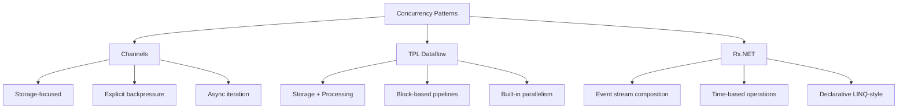
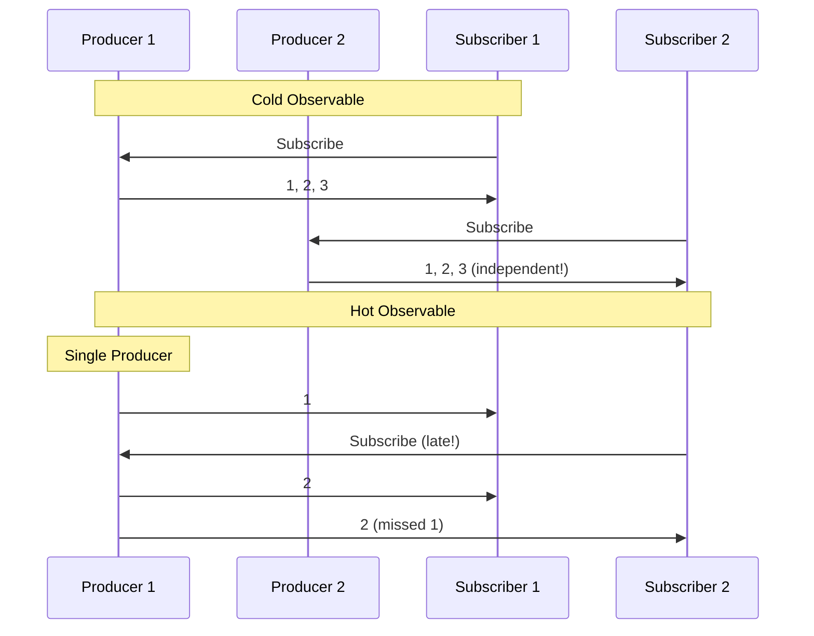

# Learn 12: Reactive Extensions (Rx.NET)

## Introduction

Reactive Extensions (Rx) is a library for composing asynchronous and event-based programs using observable sequences. While you've mastered TPL Dataflow and Channels for producer-consumer patterns, Rx.NET takes a different approach: **everything is a stream of events over time**.

Think of Rx as "LINQ for events" - you can filter, transform, merge, and compose event streams with declarative operators, just like you would with LINQ on collections.

### Rx vs. Dataflow vs. Channels



**When to use each:**
- **Channels**: Simple producer-consumer, explicit control, high performance
- **Dataflow**: Complex pipelines, parallel processing, backpressure management
- **Rx**: Event-driven scenarios, time-based operations, reactive UI, complex event composition

---

## Core Concepts

### 1. IObservable<T> and IObserver<T>

The foundation of Rx is built on two interfaces:

```csharp
public interface IObservable<out T>
{
    IDisposable Subscribe(IObserver<T> observer);
}

public interface IObserver<T>
{
    void OnNext(T value);        // Receives next value
    void OnError(Exception ex);   // Receives error (terminal)
    void OnCompleted();          // Receives completion (terminal)
}
```

**Key insight:** `IObservable<T>` is the **push-based dual** of `IEnumerable<T>` (pull-based).

| IEnumerable<T> (Pull) | IObservable<T> (Push) |
|----------------------|----------------------|
| `T GetNext()` | `OnNext(T value)` |
| `throws Exception` | `OnError(Exception)` |
| `return` (end) | `OnCompleted()` |

### 2. Creating Observables

```csharp
using System;
using System.Reactive.Linq;

// From values
var observable = Observable.Return(42);  // Single value
var range = Observable.Range(1, 5);      // 1, 2, 3, 4, 5

// From events
var clicks = Observable.FromEventPattern<MouseEventArgs>(
    button, "Click");

// From async
var result = Observable.FromAsync(() => 
    httpClient.GetStringAsync("https://api.example.com/data"));

// Create custom
var custom = Observable.Create<int>(observer =>
{
    observer.OnNext(1);
    observer.OnNext(2);
    observer.OnNext(3);
    observer.OnCompleted();
    return Disposable.Empty;
});
```

### 3. Subscribing to Observables

```csharp
IDisposable subscription = observable.Subscribe(
    onNext: value => Console.WriteLine($"Received: {value}"),
    onError: ex => Console.WriteLine($"Error: {ex.Message}"),
    onCompleted: () => Console.WriteLine("Stream completed")
);

// Dispose to unsubscribe
subscription.Dispose();

// Simple subscription (just onNext)
observable.Subscribe(value => Console.WriteLine(value));
```

---

## Hot vs. Cold Observables

This is **THE** critical distinction in Rx that trips up beginners.

### Cold Observables (Unicast)

**Definition:** A cold observable creates a **new producer** for each subscriber. Each subscriber gets its own independent sequence.

```csharp
// Cold: Each subscriber gets their own HTTP request
var cold = Observable.FromAsync(() => 
    httpClient.GetStringAsync("https://api.example.com/data"));

// Subscriber 1 triggers HTTP request #1
cold.Subscribe(data => Console.WriteLine($"Sub1: {data}"));

// Subscriber 2 triggers HTTP request #2 (independent!)
cold.Subscribe(data => Console.WriteLine($"Sub2: {data}"));
```

**Characteristics:**
- ✅ Lazy - production starts only when subscribed
- ✅ Each subscriber gets full sequence from the start
- ❌ Side effects execute multiple times (one per subscriber)
- **Examples:** `Observable.Range`, `Observable.Timer`, `FromAsync`

### Hot Observables (Multicast)

**Definition:** A hot observable has a **single shared producer**. All subscribers share the same sequence.

```csharp
// Hot: Single shared subject
var subject = new Subject<int>();

// Subscriber 1 connects
subject.Subscribe(x => Console.WriteLine($"Sub1: {x}"));

subject.OnNext(1);  // Sub1 receives: 1

// Subscriber 2 connects (misses value 1!)
subject.Subscribe(x => Console.WriteLine($"Sub2: {x}"));

subject.OnNext(2);  // Both receive: 2
subject.OnNext(3);  // Both receive: 3
```

**Characteristics:**
- ✅ Production happens independently of subscriptions
- ✅ Shared state - all subscribers get same values
- ❌ Late subscribers miss earlier values
- **Examples:** `Subject<T>`, events converted via `Publish()`, mouse movements

### Converting Cold to Hot

```csharp
// Cold observable
var cold = Observable.Interval(TimeSpan.FromSeconds(1));

// Convert to hot with Publish()
var hot = cold.Publish();

// Set up subscriptions (nothing happens yet)
hot.Subscribe(x => Console.WriteLine($"Sub1: {x}"));
hot.Subscribe(x => Console.WriteLine($"Sub2: {x}"));

// Start producing (both subscribers receive same values)
var connection = hot.Connect();

// Later: stop producing
connection.Dispose();

// Alternative: Automatic connection management
var autoConnect = cold.Publish().RefCount();  // Connects when first subscriber arrives
```

**Visual Comparison:**



---

## Common Rx Operators

### Filtering

```csharp
// Where - filter by predicate
observable.Where(x => x % 2 == 0);

// Take - first N items
observable.Take(5);

// Skip - skip first N items
observable.Skip(3);

// Distinct - eliminate duplicates
observable.Distinct();

// DistinctUntilChanged - suppress consecutive duplicates
observable.DistinctUntilChanged();
```

### Transformation

```csharp
// Select - project values
observable.Select(x => x * 2);

// SelectMany - flatten sequences
observable.SelectMany(x => Observable.Range(1, x));

// Scan - accumulate (like Aggregate but emits intermediate)
observable.Scan(0, (acc, x) => acc + x);
// Input:  1, 2, 3, 4
// Output: 1, 3, 6, 10 (running sum)
```

### Time-Based Operations

```csharp
// Throttle - emit last item after silence period
mouseMovements.Throttle(TimeSpan.FromMilliseconds(500));

// Sample - emit most recent value at intervals
sensor.Sample(TimeSpan.FromSeconds(1));

// Buffer - collect items over time window
clicks.Buffer(TimeSpan.FromSeconds(2));

// Delay - shift entire sequence forward in time
observable.Delay(TimeSpan.FromSeconds(1));

// Timeout - error if no value within period
observable.Timeout(TimeSpan.FromSeconds(5));
```

### Combining Streams

```csharp
// Merge - interleave multiple streams
Observable.Merge(stream1, stream2, stream3);

// CombineLatest - combine latest from each stream
Observable.CombineLatest(
    temperature, 
    humidity,
    (temp, hum) => new { Temperature = temp, Humidity = hum });

// Zip - pair corresponding elements
Observable.Zip(
    numbers,
    letters,
    (num, letter) => $"{num}{letter}");

// Concat - sequential concatenation (wait for first to complete)
stream1.Concat(stream2);
```

---

## Backpressure in Rx

Unlike Channels (bounded blocking) or Dataflow (BoundedCapacity), Rx uses **different strategies**:

### 1. Throttle/Sample (Drop Values)

```csharp
// Keep only latest value per time window
fastStream.Sample(TimeSpan.FromMilliseconds(100));

// Emit last after quiet period
fastStream.Throttle(TimeSpan.FromMilliseconds(200));
```

### 2. Buffer (Batch)

```csharp
// Collect into batches
fastStream.Buffer(100);  // Every 100 items
fastStream.Buffer(TimeSpan.FromSeconds(1));  // Every 1 second
```

### 3. Window (Nested Observables)

```csharp
// Create observable-of-observables
fastStream
    .Window(TimeSpan.FromSeconds(1))
    .SelectMany(window => window.Count())
    .Subscribe(count => Console.WriteLine($"Items this second: {count}"));
```

### 4. Pause/Resume with Subjects

```csharp
var pausableSubject = new Subject<bool>();
stream
    .PauseableBuffered(pausableSubject)
    .Subscribe(ProcessSlowly);

pausableSubject.OnNext(false);  // Pause
pausableSubject.OnNext(true);   // Resume
```

---

## Practical Example: Search Autocomplete

Classic Rx use case combining multiple operators:

```csharp
using System.Reactive.Linq;

IObservable<string[]> searchResults = searchTextBox
    .TextChanged()
    .Select(evt => evt.Sender.Text)
    .DistinctUntilChanged()              // Skip if same as last
    .Where(text => text.Length >= 3)     // Minimum 3 chars
    .Throttle(TimeSpan.FromMilliseconds(300))  // Wait for pause
    .SelectMany(text => 
        SearchApiAsync(text)             // Call API
            .Timeout(TimeSpan.FromSeconds(5))
            .Catch(Observable.Empty<string[]>())  // Handle errors gracefully
    );

searchResults.Subscribe(results => 
    UpdateUI(results));
```

**What's happening:**
1. Only search when text changes
2. Ignore if less than 3 characters
3. Wait 300ms of silence (user stopped typing)
4. Call async search API
5. Timeout after 5s
6. Swallow errors (don't crash UI)
7. Update UI with results

---

## Rx vs. Async/Await

| Feature | async/await | Rx |
|---------|-------------|-----|
| **Values** | Single value | Sequence of values |
| **Cancellation** | CancellationToken | Dispose subscription |
| **Composition** | Task continuation | Operators (Where, Select, Merge...) |
| **Time operations** | Task.Delay | Throttle, Sample, Buffer, Delay |
| **Error handling** | try/catch | Catch, Retry operators |

**Integration:**

```csharp
// Observable → Task
Task<int> task = observable.FirstAsync().ToTask();

// Task → Observable
IObservable<string> obs = Observable.FromAsync(() => apiCallAsync());

// Best of both worlds
IObservable<Data> stream = Observable
    .Interval(TimeSpan.FromSeconds(1))
    .SelectMany(_ => Observable.FromAsync(() => FetchDataAsync()));
```

---

## Common Patterns

### 1. Retry with Exponential Backoff

```csharp
Observable
    .FromAsync(() => UnreliableApiCallAsync())
    .Retry(3)  // Retry up to 3 times
    .Subscribe(/* ... */);

// Advanced: exponential backoff
Observable
    .FromAsync(() => UnreliableApiCallAsync())
    .RetryWhen(errors => errors
        .Select((ex, index) => (ex, index))
        .SelectMany(tuple => 
            Observable.Timer(TimeSpan.FromSeconds(Math.Pow(2, tuple.index))))
    );
```

### 2. Polling with Cancellation

```csharp
var polling = Observable
    .Interval(TimeSpan.FromSeconds(5))
    .SelectMany(_ => Observable.FromAsync(ct => PollApiAsync(ct)))
    .Subscribe(data => ProcessData(data));

// Stop polling
polling.Dispose();
```

### 3. Debounce User Input

```csharp
searchBox.TextChanged
    .Throttle(TimeSpan.FromMilliseconds(400))  // Wait for typing pause
    .DistinctUntilChanged()
    .Subscribe(text => PerformSearch(text));
```

---

## Best Practices

✅ **DO:**
- Use `Throttle`/`Sample` for UI events (mouse movements, resize)
- Dispose subscriptions to prevent memory leaks
- Use `SubscribeOn` and `ObserveOn` for threading control
- Prefer operators over manual `Subscribe` with state
- Use `Publish().RefCount()` to share expensive operations

❌ **DON'T:**
- Block in `Subscribe` callbacks (use `SubscribeOn` for CPU work)
- Forget to handle `OnError` (unhandled errors terminate stream)
- Create subjects when operators suffice
- Subscribe multiple times to cold observables with side effects

---

## Common Pitfalls

### 1. Multiple Subscriptions to Cold Observables

```csharp
// WRONG: HTTP call executed twice!
var data = Observable.FromAsync(() => httpClient.GetAsync(url));
data.Subscribe(x => UseData1(x));
data.Subscribe(x => UseData2(x));

// RIGHT: Share single execution
var shared = Observable.FromAsync(() => httpClient.GetAsync(url))
    .Publish()
    .RefCount();
shared.Subscribe(x => UseData1(x));
shared.Subscribe(x => UseData2(x));
```

### 2. Forgetting to Dispose

```csharp
// Memory leak!
Observable.Interval(TimeSpan.FromSeconds(1))
    .Subscribe(x => Console.WriteLine(x));

// Fixed
var subscription = Observable.Interval(TimeSpan.FromSeconds(1))
    .Subscribe(x => Console.WriteLine(x));
// Later:
subscription.Dispose();
```

### 3. Blocking in OnNext

```csharp
// BAD: Blocks observable thread
observable.Subscribe(x => 
{
    Thread.Sleep(1000);  // ❌ Blocks!
    Process(x);
});

// GOOD: Move to background scheduler
observable
    .ObserveOn(TaskPoolScheduler.Default)
    .Subscribe(x => 
    {
        Thread.Sleep(1000);
        Process(x);
    });
```

---

## Exercise Challenge

Build a **real-time stock price monitor** that:
1. Polls price every 2 seconds
2. Calculates 10-second moving average
3. Alerts when price changes >5% from average
4. Throttles alerts to max 1 per 5 seconds

<details>
<summary>Hint</summary>

- Use `Observable.Interval` for polling
- Use `Buffer` with time window for moving average
- Use `Scan` or `Buffer(10).Select` for calculations
- Use `Where` for threshold detection
- Use `Throttle` for alert limiting

</details>

---

## Resources

📚 **Documentation:**
- [Rx.NET Official Docs](https://github.com/dotnet/reactive)
- [ReactiveX Introduction](http://reactivex.io/intro.html)

🎥 **Videos:**
- [Introduction to Rx.NET](https://www.youtube.com/results?search_query=rx.net+tutorial) (YouTube)

📖 **Articles:**
- [Hot vs Cold Observables](https://www.christianfindlay.com/blog/rx-hot-vs-cold) - Christian Findlay
- [Processing Pipelines with Rx.NET](https://jack-vanlightly.com/blog/2018/4/19/processing-pipelines-series-reactive-extensions-rxnet) - Jack Vanlightly

---

**Key Takeaway:** Rx.NET excels at **composing event streams over time** with declarative operators. Use it when you need time-based operations, complex event composition, or reactive UI patterns. For simple producer-consumer, Channels are faster. For complex parallel pipelines, use TPL Dataflow.

##### 
